<br />

<div align="center">
    <h1> Universidad Peruana de Ciencias Aplicadas </h1>


  <p align="center">
    Ingeniería de Software - 202401
    <br />
    SW58 - Desarollo de Apliaciones Open Source
    <br />
    Docente: Efraín Ricardo Bautista Ubilús
    <br />
    Informe de Trabajo Final
    <br />
    Startup: 
    <br />
    Proyecto: UniRider
  </p>

   <table border="1">
        <tr> 
            <th>Alumno</th>
            <th>Codigo</th>
        </tr>
        <tr> 
            <td>Agama Espinoza, Eric Fabrizio</td>
            <td>U202213358</td>
        </tr>
        <tr> 
            <td>Anampa Lavado, Luis Angel</td>
            <td>U202218664</td>
        </tr>
        <tr> 
            <td>Cortez Flores, Ely Rivaldo</td>
            <td>U202215313</td>
        </tr>
        <tr> 
            <td>Mayta Lopez, Harold Jaime</td>
            <td>U202114851</td>
        </tr>
        <tr> 
            <td>Pardo Zapata, Gustavo Adolfo</td>
            <td>U202120347</td>
        </tr>
    </table>

  <p align="center">
    Abril-2024
  </p>

</div>

**Registro de Versiones del Informe**
|Versión|Fecha|Autor|Descripción de modificación|
|-------|-----|-----|---------------------------|
|V0.1|31/03/2024|Harold|Creación del repositorio|
|V0.2|02/04/2024|Harold<br>Eric<br>Ely Cortez|Implementación de los Wireflow y Capitulo 1|
|V0.3|03/04/2024|Gustavo<br>Harold<br>Luis|Finalización del capitulo 2 y 3|
|V0.4|09/04/2024|Eric<br>Harold<br>Ely Cortez|Finalización del capitulo 4|
|V1.0|10/04/2024|Gustavo<br>Luis<br>Eric <br> Harold<br> Ely Cortez|Finalización del entregable TB1|
|V1.1|25/04/2024|Gustavo<br>Luis<br>Eric <br> Harold<br> Ely Cortez|Mejoras del Informe|
|V1.2|26/04/2024|Gustavo<br>Eric <br> Harold<br> Ely Cortez|Creacion y desarrollo del Sprint 2|
|V1.3|29/04/2024|Eric <br> Harold<br> Ely Cortez|Implementacion de imagenes de evidendica|
|V2.0|29/04/2024|Gustavo<br>Luis<br>Eric <br> Harold<br> Ely Cortez|Finalización del Sprint 2|

**Project Report Collaboration Insights**
URL del repositorio de GitHub de la organización: [https://github.com/OpenUniRider](https://github.com/Unirider-OpenSource/Project-Report)

_TB1_

Para el desarrollo de la entrega TB1, se opto por dividir el trabajo de la siguiente forma

|Integrante|Actvidades Asignadas|
|----------|----------|
|Gustavo Pardo|Capitulo 2: Analisis de entrevista<br>Capitulo 3: Scenario Mapping,User Stories,Impact Mapping,Product Backlog. <br> Capitulo 5:Source Code Style Guide |
|Ely Cortez |Capitulo 1:StarUp profile,Solution Profile <br> Capitulo 4: Landing Page UI design<br> Capitulo 5: Landing Page|
|Harold Mayta |Capitulo 2: Entrevistas <br> Capitulo 4: Domain Driven SA - Database Design<br> Capitulo 5: Software Configuration Management |
|Eric Agama|Capitulo 4: Style Guidelines,Web applications UX/UI Design,Web Application Prototyping |
|Luis Anampa|Capitulo 1: Segmentos Objetivos<br>Capitulo 2: Competidores,Entrevistas,needfinding<br> Capitulo 5: Sprint Planning/Baclokg 1  |


_TP_

Para el desarrollo de la entrega TP, se opto por dividir el trabajo de la siguiente forma

|Integrante|Actvidades Asignadas|
|----------|----------|
|Gustavo Pardo|Correciones del documento <br>Sprint  backlog 2|
|Ely Cortez |Correciones del documento<br>develope and deployment evidence|
|Harold Mayta |Correciones del documento<br>Sprint planning 2|
|Eric Agama|Correciones al documento<br> execution evidence|
|Luis Anampa|Correciones deldocumento<br> Sprint review and Collaboration insigths|

<!--  -->

# Student Outcome


|Criterio Especifico|Acciones Realizadas|Conclusiones|
|-------------------|-------------------|------------|
|Comunica oralmente sus <br>ideas y/o resultados con objetividad a <br>público de diferentes <br>especialidades y niveles <br>jerarquicos, en el marco del <br>desarrollo de un proyecto eningeniería.|**Luis Anampa**<br>TB1:He participado activamente en la creación de user personas y la realización de entrevistas a usuarios, lo que me ha permitido comprender mejor las necesidades, expectativas y motivaciones de los usuarios.<br>TP:presento lo requisitos necesarios en comunicación y participacion grupal<br><br>**Gustavo Pardo**<br>TB1:Forme parte del análisis de entrevistas de manera objetiva al proyecto, destacando puntos clave identificados<br>Participe activamente en las reuniones sobre el desarrollo del proyecto.<br>TP:Durante el avance del TP participo en reuniones con el equipo para discutir el progreso del desarrollo y posibles soluciones que implementar <br><br>**Harold Mayta**<br>TB1: Se realizo reuniones con el objetivo de planificar la ruta de trabajo asi como el desarrollo de las sentrevistas a nuestro futuro publico objetivo. Se participo activamente en lluvia de ideas para claer los planes de servicio y la linea de trabajo.<br>TP:Facilito las sesiones y la organización de cada tarea asociada manteniendo una comunicacion permanente con el grupo<br><br>**Ely Cortez**<br>TB1:Durante el avance del Tb1 se realizaron diversas reuniones para acordar y verificar los avances de cada integrante,planificar y reservar tiempo para analizar las propuestas de cada integrante es  vital para el proyecto ya que nuestro objetivo es optimzar el tiempo de trabajo mediantela comunicación oral.<br>TP:Participo en reuniones para el avance del proyecto y fomento la comunicación grupal para el correcto desarrollo e implementacion de componentes<br><br>**Eric Agama**<br>TB1:Durante el proceso de desarrollo de prototipos para nuestros clientes, he reconocido la importancia fundamental de comprender sus necesidades y deseos. Esta comprensión se ha fortalecido a través de conversaciones significativas con mis compañeros, donde intercambiamos ideas y perspectivas para generar soluciones innovadoras y centradas en el cliente.<br>TP:Presento los avances correspondientes siempre comunicando mejoras del proyecto|La comunicación oral ha sido efectiva dentro del equipo, permitiendo un intercambio fluido de ideas y una comprensión compartida de los objetivos del proyecto. Se continuará fomentando esta comunicación para mantener la colaboración y el progreso del trabajo.|
|Comunica en forma escrita ideas <br>y/o resultados con objetividad a <br>público de diferentes <br>especialidades y niveles <br>jerarquicos, en el marco del <br>desarrollo de un proyecto en ingeniería.|**Luis Anampa**<br>TB1:Redacte el capitulo 2 , user persona , task matrix , journe mapping , tambien ayude en la elaboracion de los puntos del capitulo 5.<br>TP:Se hizo las correciones del diagrama de clase e implementacion al proyecto<br><br>**Gustavo Pardo**<br>TB1:<br>Redacté el capitulo 3 del informe , incluyendo el Scenario Mapping,User stories, Impact Mapping y el Product Baclkog<br>Elaboré el estilo de guía de codigo fuente y convenciones.<br>TP:Se realizo correciones segun el feedback obtenido como tambien participando en las reuniones grupales<br><br>**Harold Mayta**<br>TB1: Se realizo la separacionde trabajos de acuerdo a las competencias de cada integrante, se diseño la entrevista para nuestro publico objetivo, tambien la redaccion de los capitulos relacionados a la implementacion, valdacion. Se participo activamente del diseño de producto.<br>TP:Preparó informes de planificación del proyecto brindando seguimiento de los avances,recomendacione e implementaciones para mejorar la eficienci y la calidad del proyecto.<br><br>**Ely Cortez**<br>TB1:La colaboración entre nuestro equipo ha sido fundamental para cada miembro del equipo. Además, se ha diseñado una entrevista dirigida a nuestro público objetivo y se ha redactado con detalle los capítulos relacionados con la implementación y validación del proyecto. Todos los miembros del equipo han participado de manera activa en el diseño del producto. Esta estrategia de colaboración ha sido fundamental para alcanzar nuestros objetivos y garantizar la calidad de nuestro trabajo.<br>TP:Redacto y mostro las evidencias correspondientes para el sprint 2, elaborando propuestas de mejoras en el proceso de implementación y validación del proyecto. <br><br>**Eric Agama**<br>TB1:Este enfoque colaborativo nos ha permitido crear prototipos que no solo satisfacen las expectativas de nuestros clientes, sino que también superan sus expectativas al ofrecer soluciones que realmente resuelven sus problemas y agregan valor a sus vidas<br>TP:Elaboró propuestas de investigación y desarrollo, proporcionando reocmendaciones escritas dentro del informe.|La comunicación escrita ha sido crucial para documentar el progreso del proyecto y asegurar la comprensión de los entregables entre los miembros del equipo. Se seguirá manteniendo un enfoque claro y conciso en la comunicación escrita para garantizar la eficacia y la calidad del trabajo.|

# Contenido

- [Contenido](#contenido)
- [**Capítulo I: Introducción.**](#capítulo-i-introducción)
  - [**1.1  Startup Profile.**](#11--startup-profile)
    - [**1.1.1. Descripción del startup.**](#111-descripción-del-startup)
    - [**1.1.2.  Perfiles de los integrantes del equipo.**](#112--perfiles-de-los-integrantes-del-equipo)
  - [**1.2. Solution Profile.**](#12-solution-profile)
    - [**1.2.1. Antecedentes y Problemática.**](#121-antecedentes-y-problemática)
    - [**1.2.2. Lean UX Process.**](#122-lean-ux-process)
      - [**1.2.2.1. Lean UX Problem Statements.**](#1221-lean-ux-problem-statements)
      - [**1.2.2.2. Lean UX Assumptions.**](#1222-lean-ux-assumptions)
      - [**1.2.2.3. Lean UX Hypothesis Statements.**](#1223-lean-ux-hypothesis-statements)
      - [**1.2.2.4. Lean UX Canvas.**](#1224-lean-ux-canvas)
  - [**1.3. Segmentos objetivo.**](#13-segmentos-objetivo)
- [**Capítulo II: Requirements Elicitation \& Analysis**](#capítulo-ii-requirements-elicitation--analysis)
  - [**2.1. Competidores.**](#21-competidores)
    - [**2.1.1. Análisis competitivo.**](#211-análisis-competitivo)
    - [**2.1.2. Estrategias y tácticas frente a competidores.**](#212-estrategias-y-tácticas-frente-a-competidores)
  - [**2.2. Entrevistas.**](#22-entrevistas)
    - [**2.2.1. Diseño de entrevistas.**](#221-diseño-de-entrevistas)
    - [**2.2.2. Registro de entrevistas.**](#222-registro-de-entrevistas)
    - [**2.2.3. Análisis de entrevistas.**](#223-análisis-de-entrevistas)
  - [**2.3. Needfinding.**](#23-needfinding)
    - [**2.3.1. User Personas.**](#231-user-personas)
    - [**2.3.2. User Task Matrix.**](#232-user-task-matrix)
    - [**2.3.3. User Journey Mapping**](#233-user-journey-mapping)
    - [**2.3.4. Empathy Mapping**](#234-empathy-mapping)
    - [**2.3.5. As-is Scenario Mapping**](#235-as-is-scenario-mapping)
  - [**2.4. Ubiquitous Language**](#24-ubiquitous-language)
- [**Capítulo III: Requirements Specification.**](#capítulo-iii-requirements-specification)
  - [**3.1. To-Be Scenario Mapping.**](#31-to-be-scenario-mapping)
  - [**3.2.User Stories.**](#32user-stories)
  - [**3.3. Impact Mapping.**](#33-impact-mapping)
  - [**3.4. Product Backlog.**](#34-product-backlog)
- [**Capítulo IV: Product Design.**](#capítulo-iv-product-design)
  - [**4.1. Style Guidelines.**](#41-style-guidelines)
    - [**4.1.1. General Style Guidelines.**](#411-general-style-guidelines)
    - [**4.1.2. Web Style Guidelines.**](#412-web-style-guidelines)
  - [**4.2. Information Architecture.**](#42-information-architecture)
    - [**4.2.1. Organization Systems.**](#421-organization-systems)
    - [**4.2.2. Labeling Systems.**](#422-labeling-systems)
    - [**4.2.3. SEO Tags and Meta Tags.**](#423-seo-tags-and-meta-tags)
    - [**4.2.4. Searching Systems.**](#424-searching-systems)
    - [**4.2.5. Navigation Systems.**](#425-navigation-systems)
  - [**4.3. Landing Page UI Design**](#43-landing-page-ui-design)
    - [**4.3.1. Landing Page Wireframe.**](#431-landing-page-wireframe)
    - [**4.3.2. Landing Page Mock-up.**](#432-landing-page-mock-up)
  - [**4.4. Web Applications UX/UI Design.**](#44-web-applications-uxui-design)
    - [**4.4.1. Web Applications Wireframes.**](#441-web-applications-wireframes)
    - [**4.4.2. Web Applications Wireflow Diagrams.**](#442-web-applications-wireflow-diagrams)
    - [**4.4.3. Web Applications Mock-ups.**](#443-web-applications-mock-ups)
    - [**4.4.4. Web Applications User Flow Diagrams.**](#444-web-applications-user-flow-diagrams)
  - [**4.5. Web Applications Prototyping.**](#45-web-applications-prototyping)
  - [**4.6. Domain-Driven Software Architecture**](#46-domain-driven-software-architecture)
    - [**4.6.1. Software Architecture Context Diagram.**](#461-software-architecture-context-diagram)
    - [**4.6.2. Software Architecture Container Diagrams.**](#462-software-architecture-container-diagrams)
    - [**4.6.3. Software Architecture Components Diagrams.**](#463-software-architecture-components-diagrams)
  - [**4.7. Software Object-Oriented Design.**](#47-software-object-oriented-design)
    - [**4.7.1. Class Diagrams.**](#471-class-diagrams)
    - [**4.7.2. Class Dictionary.**](#472-class-dictionary)
  - [**4.8. Database Design.**](#48-database-design)
    - [**4.8.1. Database Diagram.**](#481-database-diagram)
- [**Capítulo V: Product Implementation, Validation \& Deployment.**](#capítulo-v-product-implementation-validation--deployment)
  - [**5.1. Software Configuration Management.**](#51-software-configuration-management)
    - [**5.1.1. Software Development Environment Configuration.**](#511-software-development-environment-configuration)
    - [**5.1.2. Source Code Management.**](#512-source-code-management)
    - [**5.1.3. Source Code Style Guide \& Conventions.**](#513-source-code-style-guide--conventions)
    - [**5.1.4. Software Deployment Configuration.**](#514-software-deployment-configuration)
  - [**5.2. Landing Page, Services \& Applications Implementation.**](#52-landing-page-services--applications-implementation)
    - [**5.2.1. Sprint 1.**](#521-sprint-1)
      - [**5.2.1.1. Sprint Planning 1.**](#5211-sprint-planning-1)
      - [**5.2.1.2. Sprint Backlog 1.**](#5212-sprint-backlog-1)
      - [**5.2.1.3. Development Evidence for Sprint Review.**](#5213-development-evidence-for-sprint-review)
      - [**5.2.1.4. Testing Suite Evidence for Sprint Review.**](#5214-testing-suite-evidence-for-sprint-review)
      - [**5.2.1.5. Execution Evidence for Sprint Review.**](#5215-execution-evidence-for-sprint-review)
      - [**5.2.1.6. Services Documentation Evidence for Sprint Review.**](#5216-services-documentation-evidence-for-sprint-review)
      - [**5.2.1.7. Software Deployment Evidence for Sprint Review.**](#5217-software-deployment-evidence-for-sprint-review)
      - [**5.2.1.8. Team Collaboration Insights during Sprint.**](#5218-team-collaboration-insights-during-sprint)
    - [**5.2.1. Sprint 2.**](#521-sprint-2)
      - [**5.2.1.1. Sprint Planning 1.**](#5211-sprint-planning-2)
      - [**5.2.1.2. Sprint Backlog 1.**](#5212-sprint-backlog-2)
      - [**5.2.1.3. Development Evidence for Sprint Review.**](#5213-development-evidence-for-sprint-review)
      - [**5.2.1.4. Testing Suite Evidence for Sprint Review.**](#5214-testing-suite-evidence-for-sprint-review)
      - [**5.2.1.5. Execution Evidence for Sprint Review.**](#5215-execution-evidence-for-sprint-review)
      - [**5.2.1.6. Services Documentation Evidence for Sprint Review.**](#5216-services-documentation-evidence-for-sprint-review)
      - [**5.2.1.7. Software Deployment Evidence for Sprint Review.**](#5217-software-deployment-evidence-for-sprint-review)
      - [**5.2.1.8. Team Collaboration Insights during Sprint.**](#5218-team-collaboration-insights-during-sprint)
- [**Capítulo VI: Conclusion.**](#capítulo-vi-conclusion)
- [**Capítulo VII: Bibliografia.**](#capítulo-vii-bibliografia)


# [**Capítulo I: Introducción.**](#capítulo-i-introducción)
## [**1.1  Startup Profile.**](#startup-profile)
En esta sección se presenta la descripción del startup y los perfiles de los miembros del equipo.
### [**1.1.1. Descripción del startup.**](#descripción-del-startup)
 La startup, presentada con el nombre de “UniRider”, se enfoca en movilizar de manera eficiente a los estudiantes universitarios. El transporte público convencional puede ser incómodo, y tener un coche propio no es una opción para muchos. Es por ello, que estamos desarrollando un sistema  que permita a estos estudiantes universitarios compartir viajes en vehículos particulares, utilizando el concepto de compartir vehículos con otros (también conocido como carpooling). Este sistema web no solo ayudará a miles de estudiantes a ahorrar dinero en transporte, sino que también contribuye a reducir el tráfico. Gracias a nuestras diversas opciones, los estudiantes podran conectarse con sus compañeros que van en la misma dirección, compartir gastos de combustible y tener una experiencia de viaje más cómoda y social.
   
   **Misión:** Revolucionar la forma en que los estudiantes universitarios se movilizan en entornos urbanos, proporcionando una solución de carpooling conveniente y económica.
   
   **Visión:** Ser la principal plataforma de carpooling para estudiantes universitarios, facilitando la movilidad urbana de manera sostenible y colaborativa.
   
   **Logotipo de la Startup:**

   

   **Logotipo del servicio:**

   
### [**1.1.2.  Perfiles de los integrantes del equipo.**](#perfiles-de-los-integrantes-del-equipo)

<table>
  <tr>
    <th>Miembro del equipo</th>
    <th>Descripción</th>
  </tr>
  <tr>
    <td></td>
    <td>Mi nombre es Eric Agama y estudio la carrera de Ingeniería de Software. Me considero una persona creativa a la hora de realizar trabajos y buscando siempre las mejores opciones para el equipo. Manejo el lenguaje Luau Roblox Studio..</td>
  </tr>
  <tr>
    <td></td>
    <td>Mi nombre es Angel Anampa y tengo 19 años. Actualmente estoy cursando la carrera de Ingeniería de Software en la UPC. Elegí dicha carrera porque soy una persona que le interesa mucho los temas que tienen que ver con tecnología , me gustan los videojuegos. Me considero una persona atenta, responsable , optimista que sabe solucionar los problemas. Como integrante del equipo me comprometo a apoyar al grupo en este trabajo.</td>
  </tr>
  <tr>
     <td></td>
    <td>Mi nombre es Ely Rivaldo Cortez Flores, tengo 18 años estudio la carrera de ingeniería de software, actualmente estoy cursando el quinto ciclo. Soy una persona empática y responsable al momento de trabajar de forma grupal.</td>
  </tr>
  <tr>
    <td></td>
    <td>Mi nombre es Harold Jaime Mayta Lopez. Tengo 20 años y estoy estudiando la carrera de Ingeniería de Software. Considero que soy una persona que es capaz de trabajar bajo presión, además de ser responsable y perseverante. En cuanto a cualidades para la realización del trabajo consideroque soy bueno identificando problemáticas y buscando soluciones.</td>
  </tr>
   <tr>
    <td></td>
    <td>Mi nombre es Gustavo Adolfo Pardo Zapata, soy estudiante de la carrera de ingeniería de software de la UPC. Soy proactivo, colaborativo, organizado,responsable y con habilidades de resolución de problemas.Tengo una excelente capacidad para comunicarme de manera efectiva y clara con los demás miembros de mi equipo y deseo colaborar en todo lo posible con mis demás compañeros en este trabajo.</td>
  </tr>
</table>


## [**1.2. Solution Profile.**](#solution-profile)
### [**1.2.1. Antecedentes y Problemática.**](#antecedentes-y-problemática)
##### What (Qué)

###### ¿Cuál es el problema?

El problema radica en la ausencia de una herramienta enfocada en el transporte universitario. Es conocido que la mayoria de  estudiantes residen en zonas alejadas a sus respectivos campus. Para llegar, suelen depender de autobuses con tiempos de espera y paradas prolongadas, lo que resulta en pérdida de tiempo durante el trayecto. Esto, con la intención de reducir los gastos de transporte a largo plazo, pero a expensas de enfrentar inseguridad, incomodidad y pérdida de tiempo debido al transporte público.
##### When (Cuando)

###### ¿Cuándo sucede el problema?

El principal desafío surge al reconocer la necesidad de ofrecer a los estudiantes universitarios un transporte rápido, cómodo y seguro, que además sea sostenible económicamente para su bolsillo. La búsqueda de una solución implica encontrar un equilibrio entre la eficiencia en el desplazamiento y la sostenibilidad financiera de los estudiantes, promoviendo así un sistema de transporte que no solo sea accesible en términos de costo, sino que también garantice la comodidad necesaria y que represente una solución contundente para abordar de manera efectiva la congestión vehicular que caracteriza a las calles de Lima.

##### Where (Donde)
###### ¿A dónde se dirige?
El servicio está diseñado para ser una herramienta de alto impacto para los estudiantes que buscan un equilibrio económico y confortable en sus desplazamientos hacia la universidad.

###### ¿Dónde surge el problema?
El problema se deriva de cuestiones socioculturales, como la inseguridad en Perú durante la espera impredecible de los transportes públicos, que puede resultar tediosa. Asimismo, el costo elevado de utilizar constantemente autos particulares para desplazarse resulta ser una opción poco viable para la economía de los estudiantes que no cuenten con los recursos económicos necesarios.

##### Who (Quién)
###### ¿Quiénes están involucrados? ¿Quién lo utilizará?
Los usuarios del sistema serán principalmente estudiantes universitarios. Por un lado, aquellos que dispongan de un vehículo y busquen generar ganacias  durante su recorrido  hacia la universidad. Por otro lado, se encuentran los estudiantes que utilizarán este servicio y su rol sera el de pasajero.

##### Why (Por qué)
###### ¿Cuál es la causa del problema?
La causa principal del problema es la falta de opciones confortables, eficientes y económicas de transporte universitario para los estudiantes.

### ¿Cuáles son las 2H?

##### How (Cómo)
###### ¿Cómo se utilizará el producto?
El producto sera empleado mediante una  plataforma web, donde los estudiantes podrán programar sus viajes, conocer los horarios y rutas disponibles, realizar pagos en línea y recibir actualizaciones en tiempo real sobre el estado del servicio. 

###### ¿Cómo lograremos desarrollar la correcta gestión del proceso de carpooling entre estudiantes?
Después de que el estudiante inicia sesión en el sistema y elige su universidad de destino, el sistema presenta los conductores disponibles que viajan por la misma ruta. Si el estudiante está conforme con la hora estimada de llegada y la calificación del conductor, puede reservar un viaje y proceder con el pago. Una vez que el conductor complete todos los asientos, debe indicar que no hay más asientos disponibles. Después de llegar a destino, los usuarios tienen la opción de calificar al conductor.

##### How much (Cuánto)
###### ¿Cuál es la magnitud del problema?
En Lima, se registran numerosos problemas socioculturales, como la delincuencia y el tráfico, que pueden ser especialmente perjudiciales para los estudiantes que suelen llevar consigo sus teléfonos celulares y computadoras portátiles (INEI, 2021). Estudios previos han demostrado que el crimen en Lima afecta negativamente la calidad de vida de los residentes, exacerbando los niveles de estrés y ansiedad (Traverso, 2020). Además, la situación del tráfico en la ciudad ha sido objeto de preocupación constante, ya que los estudiantes corren el riesgo de llegar tarde a clases o exámenes debido a las frecuentes paradas de los autobuses en cada tramo (Municipalidad Metropolitana de Lima, 2023).

###### Quienes seran los beneficiados por el servicio?
Los estudiantes universitarios que deseen una alternativa que sea eficiente, cómoda y económica, así como aquellos que busquen generar ingresos o reducir sus gastos en combustible durante su viaje hacia la universidad.

### [**1.2.2. Lean UX Process.**](#lean-ux-process)
#### [**1.2.2.1. Lean UX Problem Statements.**](#lean-ux-problem-statements)

###### Problem Statement:
El propósito de UniRider es facilitar el desplazamiento a los estudiantes universitarios de Lima , con el objetivo de reducir la probabilidad de experimentar estrés, robos o simplemente la fatiga de viajar en un autobús abarrotado, todo esto con la finalidad de reducir los gastos de pasaje.
Aunque existen aplicaciones de viajes compartidos disponibles, estas no están diseñadas específicamente para satisfacer las necesidades y preferencias de los estudiantes universitarios. Esto dificulta que los estudiantes encuentren compañeros de viaje con horarios y rutas compatibles, lo que dificultaría la posibilidad de usar un transporte compartido.
Por lo tanto, es esencial que UniRider aborde este problema mediante el desarrollo de herramientas y funcionalidades que mejoren la eficiencia y la accesibilidad del transporte compartido para los estudiantes universitarios. La aplicación debe tratar de solucionar las problemáticas identificadas en un principio para poder generar la confianza de los estudiantes y hacerse un nombre en el mercado y también en la comunidad universitaria.
Ya que se identificó que uno de los problemas es la posibilidad de que durante el viaje, no se llegue a completar todos los asientos, es por eso la importancia de tener un posicionamiento en el mercado de aplicaciones de transporte.

#### [**1.2.2.2. Lean UX Assumptions.**](#lean-ux-assumptions)
###### Business Assumptions:
1. **Creemos que nuestros usuarios necesitan** un método más eficaz para desplazarse hacia sus instituciones educativas universitarias, asegurando tanto tranquilidad como comodidad durante el trayecto.

2. **Estas necesidades se pueden satisfacer** con el desarrollo de una plataforma enfocada unicamente al transporte universitario enfocado a la comidad, eficiencia y asequible para el uso diario

3. **Nuestros clientes iniciales serán** unicamente los estudiantes universtarios que requieran el servicios y los que cuenten con un automovil y quieran ganar un adicional durante su recorrido a la universidad

4. **El valor más importante que un cliente quiere de nuestros servicios es** la equidad entre un servicio accequible, la garantia de comodidad durante el viaje y la facilidad para solicitar el proceso.

5. **El cliente también va a obtener** Beneficios adicionales, como la acumulación de puntos para poder canjear diferentes premios e incluso viajes.

6. **Vamos a obtener la mayoría de los clientes mediante**  publicidad en línea, campañas de promoción en comunidades universitarios y acudiendo a charlas programadas dentro de las universidades.

7. **Vamos a obtener ingresos mediante** el modelo de suscripción con diferentes niveles para los 2 tipos de usuarios (conductor,pasajero).

8. **Nuestra competencia en el mercado serán** en un principio los diferentes aplicativos como lo son Uber,Indrive, etc asi como los taxis particulares.

9. **Vamos a tener ventaja frente a nuestra competencia debido a** que nuestro público objetivo estará exclusivamente compuesto por estudiantes universitarios. Nuestra aplicación garantizará que durante el viaje solo participen personas que sean estudiantes, todos con el mismo punto de llegada. Como un valor agregado, ofreceremos la oportunidad para que los estudiantes puedan hacer networking durante el trayecto.

10. **El mayor riesgo del servicio es** que nuestra aplicación no logre generar un impacto significativo o no capte la atención necesaria para que los usuarios decidan probar nuestro sistema.

11. **Lo resolveremos realizando** estrategias de marketing adecuadas y promocionando nuestro servicio en charlas universitarias. Nos centraremos en generar confianza y seguridad durante los viajes, lo cual será fundamental para atraer a los usuarios. Además, planeamos regalar créditos dentro de la aplicación a las cuentas creadas mediante un código QR de invitación distribuido durante estas charlas universitarias.

###### User Assumptions:

###### ¿Quién es el usuario?
Los usuarios son, en primera parte, estudiante universitario que requiere un método eficaz y cómodo para desplazarse hacia su institución educativa unicamente en el departamento de Lima,  si la plataforma tiene éxito en este primer sector, se plantea extender esta implementación en los departamentos del interior del pais.

###### ¿Qué problemas tiene nuestro producto? ¿Resolver?

Un problema que enfrenta actualmente la aplicación es el modelo de ingresos basado en suscripciones y niveles de servicio ya que debemos garatizar que sea lo suficientemente atractivo como para generar ingresos sostenibles y cubrir los costos operativos del servicio.

###### ¿Qué características son importantes?
 
 Las características principales de la plataforma incluyen su exclusividad para estudiantes universitarios, una interfaz fácil de usar, medidas sólidas de seguridad, comodidad en los viajes y ventajas extras como la acumulación de puntos y la posibilidad de establecer contactos.

###### ¿Dónde encaja nuestro producto en su trabajo o vida?

El producto encaja en la mejora de la calidad de viaje durante el trayecto de ida y vualta hacia las universidades, permitiendo  confortabilidad y reducción de gastos de viajes.

###### ¿Cuándo y cómo es nuestro producto? ¿Usado?

Nuestro producto está diseñado para ser utilizado principalmente durante el período académico, cuando los estudiantes universitarios necesitan desplazarse hacia y desde sus instituciones educativas. 

###### ¿Cómo debe verse nuestro producto y cómo debe comportarse?

El producto debe presentar un diseño intuitivo y amigable, con características que pueden ser adaptadas según las preferencias de cada usuario. Además, debe proporcionar información concisa sobre los conductores, vehículos y costos, manteniendo la seguridad como una prioridad con medidas sólidas. 

######  Feature Assumptions:

**Creemos que** la aplicación deberia tener la interfaz inicial con las opciónes principales una vez dentro de la app
para agilizar  el proceso de uso.

**Creemos que** el sistema debería considerar medidas de riesgo ante una situación de emergencia, es decir, añadir una función que reporte automáticamente la situación a las autoridades.

**Creemos que** el sistema deberia 

**Creemos que** el sistema debería integrarse con sistemas de pago móvil para facilitar el proceso de compartir los costos del viaje entre los usuarios, permitiendo transacciones seguras y sin problemas directamente desde la aplicación.

 **Creemos que** la aplicación debería ofrecer opciones de viaje compartido programado, donde los usuarios puedan planificar y reservar viajes con anticipación.

#### [**1.2.2.3. Lean UX Hypothesis Statements.**](#lean-ux-hypothesis-statements)

 - **Hypothesis Statement 01:**
   **Creemos que** los estudiantes consideran como primera opción nuestro servicio para el transporte hacia sus respectivas instituciones
   **Sabremos** que hemos tenido exito
   **Cuando**  realicemos encuestas a estudiantes y la mayoría indique que prefieren nuestro servicio debido a su confiabilidad, comodidad y costo en comparación con otras opciones de transporte.

 - **Hypothesis Statement 02:**
  **Creemos que** al ofrecer descuentos exclusivos a través de nuestra aplicación móvil, aumentaremos la lealtad de los clientes.
  **Sabremos** que hemos tenido éxito
  **Cuando** observemos un aumento en la participación de los clientes que utilizan los descuentos ofrecidos a través de la aplicación móvil, así como un aumento general de uso y el uso continuo del usuario.


 - **Hypothesis Statement 03:**
   **Creemos que** debemos priorizar la regulridad del registro, verificando de manera eficaz que la totalidad de nuestros usuarios son estudiantes de alguna institución
   **Sabremos** que hemos tenido exito
   **Cuando**  no registremos ningún reporte de algún altercado o durante la regularización de usuarios durante el recorrido.

 - **Hypothesis Statement 04:**
   **Creemos que**  al implementar un sistema de emparejamiento  basado en la ubicación y los horarios de los estudiantes, aumentaremos la conveniencia y la eficiencia del carpooling universitario.
   **Sabremos**  que hemos tenido éxito
   **Cuando**  se demuestre una disminución en el tiempo promedio de espera para encontrar un compañero de viaje 

#### [**1.2.2.4. Lean UX Canvas.**](#lean-ux-canvas)


## [**1.3. Segmentos objetivo.**](#segmentos-objetivo)

Por medio de nuestro enfoque de obtener una solución efectiva a las problemáticas de nuestros futuros usuarios, identificamos los siguientes segmentos para UniRider:

**Segmento objetivo #1: Estudiantes Universitarios que necesiten movilizarse.**

Aspectos demográficos:

- Sexo: masculino y femenino

- Edades: adultos entre 18 - 30 años

- Nivel socioeconómico: clases A, C, C (alta, media-alta y media)

Aspectos geográficos:

- Nacionalidad: Peruana
  
- Zona geográfica en la que vive: Urbana
  
- Departamento: Lima Metropolitana

Aspectos psicográficos:

- Abiertos a herramientas que les ayuden a simplificar y facilitar su viaje.
  
- Son hábiles dentro del uso de dispositivos inteligentes.

**Segmento objetivo #2: Estudiantes Universitarios propetarios de vehiculo privado.**

AAspectos demográficos:

- Sexo: masculino y femenino

- Edades: adultos entre 18 - 30 años

- Nivel socioeconómico: clases A, C, C (alta, media-alta y media)

Aspectos geográficos:

- Nacionalidad: Peruana
  
- Zona geográfica en la que vive: Urbana
  
- Departamento: Lima Metropolitana

Aspectos psicográficos:

- Son hábiles dentro del uso de dispositivos inteligentes.


# [**Capítulo II: Requirements Elicitation \& Analysis**](#capítulo-ii-requirements-elicitation--analysis)
## [**2.1. Competidores.**](#competidores)
### [**2.1.1. Análisis competitivo.**](#análisis-competitivo)

<table><tr><th colspan="6" valign="top"><a name="_lfp2lf9xoms"></a><b>Competitive Analysis Landscape</b></th></tr>
<tr><td colspan="6" valign="top"><p><b>¿Por qué llevar a cabo este análisis?</b>  </p><p>La realización de un análisis competitivo permite a UniRider entender su posición en el mercado frente a sus competidores. Identificar fortalezas, debilidades, oportunidades y amenazas proporcionará a UniRider insights valiosos para ajustar su estrategia, innovar en su oferta de valor y mejorar su enfoque de mercado. </p></td></tr>
<tr><td colspan="2" valign="top"><b>Nombre</b></td><td valign="top"><b>UniRider</b></td><td valign="top"><b>BlaBlaCar</b></td><td valign="top"><b>Carpool World</b></td><td valign="top"><b>Waze Carpool</b></td></tr>
<tr><td colspan="2" valign="top"><b>Logo</b></td><td valign="top"></td><td valign="top"></td><td valign="top"></td><td valign="top"></td></tr>
<tr><td rowspan="2" valign="top"><b>Perfil</b></td><td valign="top"><b>Overview</b></td><td valign="top">Es una app web  especializada en carpooling para estudiantes universitarios, diseñada para facilitar una forma económica y social de viajar. La app conecta a estudiantes que van en la misma dirección, permitiéndoles compartir experiencias de viaje.</td><td valign="top">Es una plataforma líder en carpooling que conecta a conductores con asientos libres y a pasajeros que buscan viajar la misma ruta, enfocándose principalmente en viajes largos. La plataforma promueve la interacción social y la confianza mediante perfiles detallados y sistemas de calificación.</td><td valign="top">Es una plataforma global de carpooling que ofrece un servicio básico y directo para conectar a conductores y pasajeros, sin centrarse en un nicho específico. Su objetivo es facilitar el carpooling para cualquier tipo de viaje, ya sea para el trabajo, la escuela o viajes largos.</td><td valign="top">Se enfoca en conectar a conductores y pasajeros para viajes diarios, aprovechando su avanzada tecnología de mapeo y tráfico para optimizar las rutas. Su propuesta es reducir la cantidad de vehículos en la carretera mediante el fomento del carpooling basado en la eficiencia.</td></tr>
<tr><td valign="top"><p><b>Ventaja competitiva</b></p><p><b>¿Qué valor ofrece a los clientes</b></p></td><td valign="top">Su ventaja radica en su enfoque específico en estudiantes universitarios, ofreciendo una solución personalizada para sus necesidades de movilidad. Esto incluye tarifas económicas, flexibilidad horaria y un ambiente de viaje social y seguro.</td><td valign="top">Se centra en viajes largos y la interacción social entre usuarios. Su valor principal es la confiabilidad y la extensa red de usuarios.</td><td valign="top">Ofrece una plataforma global que conecta a conductores y pasajeros sin enfocarse en un nicho específico. Su valor reside en la amplitud de su servicio.</td><td valign="top">Aprovecha su tecnología de navegación para optimizar las rutas de carpooling, dirigido a quienes buscan eficiencia y rapidez en sus viajes diarios.</td></tr>
<tr><td rowspan="2" valign="top"><b>Perfil de Marketing</b></td><td valign="top"><b>Mercado Objetivo</b></td><td valign="top"><p>-Estudiantes universitarios de Lima.</p><p></p><p>-Estudiantes universitarios con auto.</p><p></p></td><td valign="top">Viajeros de larga distancia interesados en compartir gastos y experiencias.</td><td valign="top">Amplio, desde viajeros diarios hasta quienes buscan compañeros para viajes largos.</td><td valign="top">Profesionales y estudiantes que buscan rutas eficientes para sus viajes diarios.</td></tr>
<tr><td valign="top"><b>Estrategias de Marketing</b></td><td valign="top">Campañas en redes sociales, asociaciones con universidades y promociones dirigidas a estudiantes.</td><td valign="top">Marketing de contenido, SEO y publicidad en plataformas de viaje.</td><td valign="top">Enfoque en SEO y presencia en eventos de sostenibilidad.</td><td valign="top">Publicidad digital aprovechando la base de usuarios de Waze y promociones en la app de navegación.</td></tr>
<tr><td rowspan="3" valign="top"><b>Perfil de Producto</b></td><td valign="top"><b>Productos y Servicios</b></td><td valign="top">Carpooling diseñado para estudiantes, con funciones de seguridad y socialización.</td><td valign="top">Carpooling para viajes largos, con perfiles detallados de usuarios.</td><td valign="top">Plataforma de carpooling con un sistema de búsqueda flexible.</td><td valign="top">Carpooling basado en la eficiencia de rutas, con integración total con la app de Waze.</td></tr>
<tr><td valign="top"><b>Precios y Costos</b></td><td valign="top">Sitio web para el registro y uso de nuestro aplicativo</td><td valign="top">Sitio web</td><td valign="top">Sitio web</td><td valign="top">Sitio web</td></tr>
<tr><td valign="top"><b>Canales de distribución (Web y/o móvil)</b></td><td valign="top">Contará con aplicación web adaptable a cualquier dispositivo con navegador</td><td colspan="3" valign="top"><p></p><p>Cuenta con aplicación móvil y sitio web.</p></td></tr>
<tr><td rowspan="4" valign="top"><b>Análisis SWOT</b></td><td valign="top"><b>Fortalezas</b></td><td valign="top">Fuerte conexión con el nicho de estudiantes, tarifas económicas, enfoque en la seguridad.</td><td valign="top">Gran base de usuarios, fiabilidad, presencia internacional.</td><td valign="top">Flexibilidad global, diversidad de usuarios.</td><td valign="top">Eficiencia en rutas, tecnología avanzada, gran base de usuarios de Waze.</td></tr>
<tr><td valign="top"><b>Debilidades</b></td><td valign="top">Limitado inicialmente a ciertas áreas geográficas, necesidad de crecimiento rápido para asegurar suficientes usuarios.</td><td valign="top">Menos enfocado en viajes cortos diarios.</td><td valign="top">Falta de enfoque en nichos específicos.</td><td valign="top">Puede no ser ideal para quienes buscan interacción social.</td></tr>
<tr><td valign="top"><b>Oportunidades</b></td><td valign="top">Expansión a nuevas universidades, alianzas con empresas de transporte público.</td><td valign="top">Crear servicios adicionales para viajes cortos.</td><td valign="top">Especialización en nichos no explorados.</td><td valign="top">Integración con otros servicios de movilidad.</td></tr>
<tr><td valign="top"><b>Amenazas</b></td><td valign="top">Competencia de plataformas establecidas, cambios en regulaciones de transporte.</td><td valign="top">Nuevos competidores en el nicho de viajes largos.</td><td valign="top">Superación por plataformas más innovadoras o especializadas.</td><td valign="top">Cambios en la preferencia de los usuarios hacia opciones más socializadas.</td></tr>
</table>

### [**2.1.2. Estrategias y tácticas frente a competidores.**](#estrategias-y-tácticas-frente-a-competidores)

Haciendo uso de del análisis FODA anterior, hemos planteado las siguientes estrategias competitivas:

Estrategias de cercanía con los usuarios:

#1 Contactos con instituciones educativas para promocionar nuestra aplicación 

UniRider al ser nuevo en el mercado tiene una gran desventaja en este aspecto. Para solucionar este problema se puede contactar con las instituciones educativas locales que ayuden a promocionar nuestra aplicación a través de sus redes y asi obtener la confiabilidad de nuestros usuarios. 

#2 Realizar encuestas de satisfacción para los clientes
Hemos visto que los clientes de la competencia tienen ideas o reseñas de la aplicación que les gustaría compartir y también que sean tomados en cuenta. Para ello, UniRider organizará cada 2 meses una encuesta de satisfacción de usuario, en la cual podrá decir su opinión de la aplicación así como ideas que les gustaría que tuviera nuestro producto.

Estrategias de liderazgo a través del producto:

#1 Ofrecer más características gratuitas

Se analizó que muchos de nuestros competidores tienen funciones de pago que pueden ser muy requeridas para los clientes. Con esto en mente, UniRider agregará más de estas características de forma gratuita para nuestros usuarios.

#2  Garantizar un sistema de guardado de información

UniRider se compromete a implementar un sistema de guardado de información para ofrecer a nuestros clientes la capacidad de guardar sus rutas de viaje. Este sistema se diseñará con el objetivo de proporcionar una experiencia sin problemas y garantizar la confidencialidad de los datos del usuario.

## [**2.2. Entrevistas.**](#entrevistas)
### [**2.2.1. Diseño de entrevistas.**](#diseño-de-entrevistas)


Con el propósito de conocer la realidad de nuestros usuarios, buscamos obtener su punto de vista con respecto a su conocimiento e interés en relación con el servicio de carpooling que ofrecemos en UniRider. Queremos comprender mejor cómo perciben nuestra aplicacion, qué características valoran más y cómo podemos mejorar su experiencia general.


**Segmento objetivo #1:** Estudiantes Universitarios que necesiten movilizarse

_Preguntas principales_:

- ¿Crees necesario que la aplicación incorpore un sistema de verificación de identidad con un documento oficial al registrar una cuenta? ¿Por qué?

- ¿Cómo te sentirías acerca de tener la capacidad de compartir tus experiencias y calificar a los conductores después de cada viaje?

- ¿Qué información te gustaría poder acceder en tu historial de viajes para sentirte más seguro/a al utilizar nuestra plataforma?

- Comúnmente , ¿Cuál es tu preferencia al momento de realizar pagos: utilizar una billetera virtual o pagar en efectivo directamente al conductor?

- ¿Consideras la posibilidad de comunicarte directamente con el conductor a través de un chat? ¿Por qué crees que esta función sería beneficiosa para los usuarios?

- ¿Qué tipo de notificaciones consideras útiles para mantenerte informado/a sobre nuevos viajes disponibles o cambios en los planes de viaje?

- ¿Crees que sería útil para los usuarios poder visualizar el perfil del conductor? ¿Qué información crees que debería incluirse en dicho perfil?

- ¿Te sentirías más seguro utilizando nuestra aplicación si ofreciéramos un soporte técnico rápido y eficiente para resolver cualquier problema que pueda surgir?


_Preguntas complementarias_:


- ¿Qué factores consideras al seleccionar un viaje, aparte de la ubicación y la hora de salida?

- ¿Crees que sería beneficioso establecer colaboraciones con universidades u otras instituciones educativas para promover el uso de nuestro servicio de carpooling entre los estudiantes?


**Segmento objetivo #2:** Conductores

_Preguntas principales_:

- ¿Crees necesario que la aplicación incorpore un sistema de verificación de identidad con un documento oficial al registrar una cuenta? ¿Por qué?

- ¿Cuánto tiempo llevas conduciendo y cuál es tu experiencia en viajes largos o diarios?

- ¿Crees que sería importante para los conductores recibir notificaciones en caso de cancelar un asiento reservado por un pasajero? ¿Por qué crees que esta función podría mejorar la comunicación y la experiencia del usuario?

- ¿Qué tan flexible es tu horario para conducir y cuántos días a la semana estarías dispuesto/a a compartir viajes?

- ¿Qué expectativas tienes en cuanto a la compensación económica por compartir tus viajes como conductor en UniRider?

- ¿Consideras útil la posibilidad de establecer la ruta de viaje antes del inicio del viaje? ¿Por qué crees que esta función podría ser beneficiosa para la planificación de tus viajes?


_Preguntas complementarias_:

- ¿Cómo planeas equilibrar tus responsabilidades académicas con tus compromisos como conductor en UniRider?

- ¿Has tenido experiencia previa compartiendo viajes con otros estudiantes?

- ¿Estarías dispuesto/a a promover activamente UniRider entre otros estudiantes en el campus para aumentar la participación en la plataforma?

### [**2.2.2. Registro de entrevistas.**](#registro-de-entrevistas)

**Segmento objetivo #1:** Estudiantes Universitarios que necesiten movilizarse.


**Entrevistado N°1:** Dayana Melina Rojas Sosa

**- Sexo:** Femenino

**- Edad:** 19 años

**- Ubicación en la que vive:** Lima Ate

**Acerca de la entrevista:** Estudiante de la UPC

**- Link:** [upc-pre-202401-si729-SW58-interviews](https://upcedupe-my.sharepoint.com/:v:/g/personal/u202120347_upc_edu_pe/EfowbxxGBQVOoyk745LqFXEBnq9i_JaPQ1iGuiLOJ4Nc8Q?e=fNxcvi&nav=eyJyZWZlcnJhbEluZm8iOnsicmVmZXJyYWxBcHAiOiJTdHJlYW1XZWJBcHAiLCJyZWZlcnJhbFZpZXciOiJTaGFyZURpYWxvZy1MaW5rIiwicmVmZXJyYWxBcHBQbGF0Zm9ybSI6IldlYiIsInJlZmVycmFsTW9kZSI6InZpZXcifX0%3D)


**- Instante en el que inicia:** 26:53 min

**- Duración:** 5:34 min

**Resumen:**

Se enfatiza la importancia de la seguridad y la confiabilidad al utilizar el servicio de carpooling. Valorizan la verificación de identidad, la comunicación directa con el conductor y un soporte técnico eficiente. Además, buscan informacion detallada del conductor y prefiere el metodo de pago en efectivo. La calificación del conductor es un factor crucial al seleccionar un viaje y considera promover el servicio de Unirider. En general desea una experiencia segura, transparente y cómoda al utilizar el servicio de carpooling.


**Entrevistado N°2:** Jhunior Giussepe Taquiro Calderon

**- Sexo:** Masculino

**- Edad:** 20 años

**- Ubicación en la que vive:** Lima Surco

**Acerca de la entrevista:** Estudiante de ingenieria de Software

**- Link:** [upc-pre-202401-si729-SW58-interviews](https://upcedupe-my.sharepoint.com/:v:/g/personal/u202120347_upc_edu_pe/EfowbxxGBQVOoyk745LqFXEBnq9i_JaPQ1iGuiLOJ4Nc8Q?e=fNxcvi&nav=eyJyZWZlcnJhbEluZm8iOnsicmVmZXJyYWxBcHAiOiJTdHJlYW1XZWJBcHAiLCJyZWZlcnJhbFZpZXciOiJTaGFyZURpYWxvZy1MaW5rIiwicmVmZXJyYWxBcHBQbGF0Zm9ybSI6IldlYiIsInJlZmVycmFsTW9kZSI6InZpZXcifX0%3D)


**- Instante en el que inicia:** 39:49 min

**- Duración:** 3:51 min

**Resumen:**

El entrevistado destaca la importancia de la verificación de identidad y la calificación de conductores para garantizar la seguridad. Valora la comunicación directa con los conductores y prefiere pagar en efectivo. Considera esencial contar con información detallada del conductor y aprueba un soporte técnico eficiente. Al seleccionar un viaje prioriza el precio y la calificación del conductor. Además, ve positiva la idea de promover el servicio entre estudiantes a través de colaboraciones con instituciones educativas.


**Entrevistado N°3:** Cristhian Jeaker Araujo Canales

**- Sexo:** Masculino

**- Edad:** 20 años

**- Ubicación en la que vive:** Lima San Juan de Lurigancho

**Acerca de la entrevista:** Estudia ciencia de la computacion en la UPC

**- Link:** [upc-pre-202401-si729-SW58-interviews](https://upcedupe-my.sharepoint.com/:v:/g/personal/u202120347_upc_edu_pe/EfowbxxGBQVOoyk745LqFXEBnq9i_JaPQ1iGuiLOJ4Nc8Q?e=fNxcvi&nav=eyJyZWZlcnJhbEluZm8iOnsicmVmZXJyYWxBcHAiOiJTdHJlYW1XZWJBcHAiLCJyZWZlcnJhbFZpZXciOiJTaGFyZURpYWxvZy1MaW5rIiwicmVmZXJyYWxBcHBQbGF0Zm9ybSI6IldlYiIsInJlZmVycmFsTW9kZSI6InZpZXcifX0%3D)


**- Instante en el que inicia:** 32:27 min

**- Duración:** 7:22 min

**Resumen:**

El entrevistado comprende la importacia del carpooling y su impacto en la seguridad al evitar cuentas duplicadas. Destaca la utilidad de compartir experiencias y calificar a los conductores. Desea visualizar rutas y detalles del conductor, prefiere pagar en efectivo pero acepta monedero virtual. Valora la comunicación directa con el conductor. Solicita información detallada del automóvil y un soporte tecnicmo eficientes. Sugiere colaboraciones con universidades para mejorar el acceso al servicio para todos los estudiantes.

**Segmento objetivo #2:** Estudiantes Universitarios propetarios de vehiculo privado.


**Entrevistado N°4:** Jefrey Sanchez

**- Sexo:** Masculino

**- Edad:** 23 años

**- Ubicación en la que vive:** Callao

**Acerca de la entrevista:** Estudia Ingenieria de software en la UPC cursando en el septimo ciclo actualmente

**- Link:** [upc-pre-202401-si729-SW58-interviews](https://upcedupe-my.sharepoint.com/:v:/g/personal/u202120347_upc_edu_pe/EfowbxxGBQVOoyk745LqFXEBnq9i_JaPQ1iGuiLOJ4Nc8Q?e=fNxcvi&nav=eyJyZWZlcnJhbEluZm8iOnsicmVmZXJyYWxBcHAiOiJTdHJlYW1XZWJBcHAiLCJyZWZlcnJhbFZpZXciOiJTaGFyZURpYWxvZy1MaW5rIiwicmVmZXJyYWxBcHBQbGF0Zm9ybSI6IldlYiIsInJlZmVycmFsTW9kZSI6InZpZXcifX0%3D)


**- Instante en el que inicia:** 7:00

**- Duración:** 9:26 min

**Resumen:**

El posible conductor de UniRider enfatiza la necesidad de verificación de identidad tanto para los conductores y pasajeros, sugiere notificaciones de cancelación de asientos.Espera utilizar las ganancias obtenidas para el debido mantenimiento del automóvil y esta dispuesto a promover la plataforma entre otros estudiantes. Cabe resaltar que muestra un gran compromiso con la calidad del servicio y la seguridad del conductor y de los futuros usuarios , ya que conoce lo agotador y dificil que puede ser el viaje a un centro de estudios


**Entrevistado N°5:** Leo Sicha

**- Sexo:** Maxculino

**- Edad:** 22 años

**- Ubicación en la que vive:** Ate

**Acerca de la entrevista:** Estudia Ingenieria de Sistemas en la UPC

**- Link:** https://drive.google.com/file/d/1QHZQD3JM9jqrBbkbcWzPBekCUn0aHpe4/view?usp=sharing

**- Instante en el que inicia:** 00:00 min

**- Duración:** 7:00 min

**Resumen:**

El conductor se muestra a favor de la verificación de identidad para garantizar la seguridad de todos los usuarios. Aunque tiene poca experiencia en viajes largos, está acostumbrado al tráfico en Lima y esta dispuesto a brindar el servicio de carpoolig. Considera necesaria la función de cancelación para evitar problemas y esta interesado en ganar un ingreso de forma pasiva al compartir su viaje. Valora la posibilidad de crear rutas para una mejor organización del servicio. Además,tuvo experiencia previa llevando compañeros en su misma ruta y esta dispuesto a promover activamente UniRider.


**Entrevistado N°6:** Mathias Kunimoto

**- Sexo:** Masculino

**- Edad:** 20 años

**- Ubicación en la que vive:** Jesus Maria

**Acerca de la entrevista:** Estudiante ing de software en la UPC actualmente en el quinto ciclo de la carrera

**- Link:**  [upc-pre-202401-si729-SW58-interviews](https://upcedupe-my.sharepoint.com/:v:/g/personal/u202120347_upc_edu_pe/EfowbxxGBQVOoyk745LqFXEBnq9i_JaPQ1iGuiLOJ4Nc8Q?e=fNxcvi&nav=eyJyZWZlcnJhbEluZm8iOnsicmVmZXJyYWxBcHAiOiJTdHJlYW1XZWJBcHAiLCJyZWZlcnJhbFZpZXciOiJTaGFyZURpYWxvZy1MaW5rIiwicmVmZXJyYWxBcHBQbGF0Zm9ybSI6IldlYiIsInJlZmVycmFsTW9kZSI6InZpZXcifX0%3D)


**- Instante en el que inicia:** 16:27

**- Duración:** 10:26

**Resumen:**

El entrevistado expresa la necesidad de verificar la información debido a la informalidad en el país. Lleva conduciendo 1 año y 2 meses y se siente cómodo manejando rutas largas.Valora la cancelación para que los pasajeros elijan según sus condiciones. Quiere esablecer su propia ruta para ganar ingresos pasivos. Dispuesto a promover UniRider como una opción segura y cómoda para los estudiantes. En resumen, prioriza la seguridad y comodidad del servicios

### [**2.2.3. Análisis de entrevistas.**](#análisis-de-entrevistas)

A continuación se proporciona un análisis resumido para cada segmento.

**Segmento objetivo #1:** Estudiantes Universitarios que necesitan movilizarse.

* Los entrevistados enfatizan la importancia de la seguridad y la confiabilidad al utilizar el servicio de carpooling.

* Valoran la verificación de identidad, la comunicación directa con el conductor y un soporte técnico eficiente

* Prefieren pagar en efectivo y consideran esencial contar con información detallada del conductor

* La calificación del conductor es un factor crucial al seleccionar un viajje y consideran promover el servicio de Unirider

* Desean una experiencia segura, transparente y comoda al utilizar el servicio de carpooling.

**Analisis detallado con estadistica:**

 El 100% de los entrevistado desean seguridad,confiabilidad y consideran prioritario la calificación del conductor.
 
 El 60% de los entrevistados prefierio pagar en efectivo, mientras que el 40% optó por usar un monedero virtual.

**Segmento objetivo #2:** Estudiantes Universitarios propietarios de vehiculo privado.

* Los entrevistados también destacan la importancia de la seguridad y confiabilidad en el servicio.

* Valoran la verificación de identidad para garantizar la seguridad de todos los usuario.

* Están dispuestos a compartir sus viajes para ganar ingresos pasivos y promover activamente Unirider.

* Priorizan la calidad del servicio y la seguridad del conductor y los futuros usuarios

**Analisis detallado con estadistica:**

 100% de los entrevistado desean seguridad y confiabilidad como tambien tienene la disposicion de compartir los aviajes.

## [**2.3. Needfinding.**](#needfinding)

Presentamos las siguientes necesidades principales que hemos analizado en base a nuestros usuarios:

**Segmento #1:** Estudiantes Universitarios que necesiten movilizarse

- Una información más detallada del conductor en el historial de viaje.
  
- Una aplicación intuitiva que sea fácil de manejar.
  
- La confiabilidad al utilizar el servicio de carpooling.
  
- Experiencia de parte de los conductores.
  
- La capacidad de comunicarse directamente con el conductor antes y durante el viaje.
  
**Segmento objetivo #2:** Estudiantes Universitarios propietarios de vehiculo privado.

- La seguridad y confiabilidad en el servicio.
  
- Flexibilidad de horarios 
  
- Facilidad de coordinacion
  
- Notificacion por cancelacion de asientos
  
- Creación de rutas para una mejor organización del servicio.

### [**2.3.1. User Personas.**](#user-personas)

A continuación, se presentarán los user persona basados en nuestro segmento objetivo. Estos son arquetipos de nuestros usuarios ideales para nuestro segmento principal. 

**Segmento objetivo #1: Estudiantes Universitarios que necesiten movilizarse**


**Segmento objetivo #2: Estudiantes Universitarios propetarios de vehiculo privado**


### [**2.3.2. User Task Matrix.**](#user-task-matrix)

## **Ana Lopez**

| Actividades | Frecuencia | Importancia | 
|-------------|------------|-------------|
| Investigar opciones de transporte. | Con frecuencia | Alta | 
| Investigar opciones de transporte compartido. | A veces | Alta | 
| Participar en grupos de viaje compartido. | A veces  | Media | 
| Buscar rutas de viaje	 |  Con frecuencia | Media | 
| Coordinar viajes | A veces | Media | 
| Investigar opciones de transporte sostenible | Rara vez | Media | 


## **Luis Gomez**


| Actividades | Frecuencia | Importancia | 
|-------------|------------|-------------|
| Busca de compartir los gastos del combustible | A veces | Media | 
| Encontrar compañeros de viaje con horarios y rutas compatibles | Con frecuencia | Alta | 
| Investigar opciones de transporte compartido |Con frecuencia  | Media | 
| Coordinar horario y ruta de viajes | A veces | Media | 
| Registrar gastos de transporte	 | A veces | Media | 
| Explorar alternativas de transporte |A veces  | Media | 

### [**2.3.3. User Journey Mapping**](#user-journey-mapping)

**Ana Lopez**


**Luis Gomez**


### [**2.3.4. Empathy Mapping**](#empathy-mapping)

**Ana Lopez**


**Luis Gomez**


### [**2.3.5. As-is Scenario Mapping**](#as-is-scenario-mapping)

*Segmento Estudiantes Universitarios que necesiten movilizarse*


*Segmento Estudiantes Universitarios propetarios de vehiculo privado*


## [**2.4. Ubiquitous Language**](#ubiquitous-language)

# [**Capítulo III: Requirements Specification.**](#capítulo-iii-requirements-specification)
## [**3.1. To-Be Scenario Mapping.**](#to-be-scenario-mapping)

En esta sección se resume la información recopilada, se realiza dos tablas con la situación a mejorar del segmento objetivo, analizando que pasos que se realizaran y como se siente.

*Segmento Estudiantes Universitarios que necesiten movilizarse*

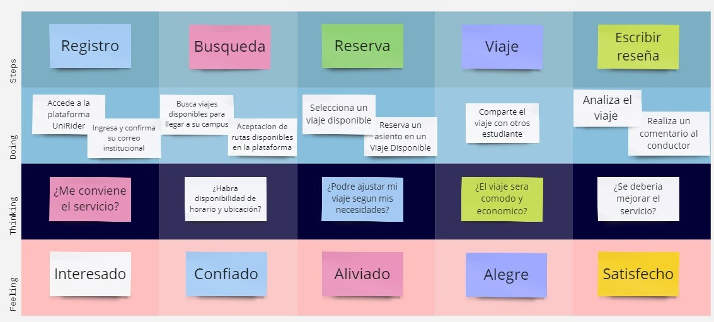

*Segmento Estudiantes Universitarios propetarios de vehiculo privado*


## [**3.2.User Stories.**](#user-stories)

|Epic/Story ID|Titulo|Descripción|Criterios de aceptación|Relacionado con (Epic ID)|
|-------------|------|-----------|-----------------------|-------------------------|
|ES01|Registro de usuario|**Como** Usuario **Quiero** poder crear mi usuario **Para** acceder al servicio de carpooling|El usuario puede completar el formulario de registro con información personal. El usuario recibe un correo electrónico de confirmación después del registro.|ES01|
|ES02|Búsqueda de Viaje Disponibles|**Como** Usuario **Quiero** buscar viajes disponibles **Para** poder planificar mis desplazamientos|El usuario puede filtrar los resultados de búsqueda por ubicación, hora de salida y otros criterios. El usuario puede ver una lista de viajes disponibles con información detallada.|ES02|
|ES03|Reserva de Viaje|**Como** Usuario **Quiero** poder reservar un asiento en el viaje disponible **Para** garantizar mi lugar.|El usuario puede acceder a la página de detalles del viaje desde su perfil. El usuario puede encontrar la opción para reservar un asiento y confirmar la reserva.|ES03|
|ES04|Comunicación con el Conductor|**Como** Usuario **Quiero** poder comunicarme con el conductor de mi viaje **Para** coordinar detalles y obtener información adicional.|El usuario puede comunicarse con el conductor a través de la plataforma UniRider. El conductor puede responder a las consultas y proporcionar información adicional.|ES04|
|ES05|Cancelación de Reserva|**Como** Usuario **Quiero** poder cancelar una reserva de viaje **Para** los casos de que surjan imprevistos|El usuario puede acceder a la página de detalles de su reserva desde su perfil. El usuario puede encontrar la opción para cancelar su reserva y confirmar la cancelación.|ES05|
|ES06|Calificación y Comentario del Conductor|**Como** Usuario **Quiero** poder calificar y dejar comentarios sobre la experiencia de viaje con el conductor **Para** ayudar a otros usuarios en su elección|El usuario puede calificar al conductor después del viaje con una puntuación y un comentario opcional. La calificación y el comentario se registran en el perfil del conductor.|ES06|
|US01|Visualizar planes de servicio|**Como** Usuario **Quiero** visualizar los planes de servicio **Para** visualizar los precios y beneficios que me brindan|**Escenario:** El usuario visualiza el plan Premium **Dado que** el usuario está en la sección de planes de servicio **Cuando** selecciona el plan **Entonces** se le mostrará los detalles de los beneficios de dicho plan|ES01|
|US02|Seleccionar plan de servicio|**Como** Usuario **Quiero** seleccionar un plan de servicio **Para** adquirir los beneficios ofrecidos|**Escenario:** El usuario selecciona el plan Estándar **Dado que** el usuario visualiza los planes de servicio **Cuando** selecciona el plan deseado **Entonces** se le redirige a la página de pago|ES01|
|US03|Realizar pago del plan|**Como** Usuario **Quiero** realizar el pago del plan seleccionado **Para** activar los beneficios ofrecidos|**Escenario:** El usuario completa el pago del plan Premium **Dado que** el usuario ha seleccionado el plan deseado **Cuando** completa los datos de pago y procede con la transacción **Entonces** recibe una confirmación del pago realizado|ES01|
|US04|Verificar identidad del conductor|**Como** Usuario **Quiero** verificar la identidad del conductor **Para** garantizar mi seguridad durante el viaje|**Escenario:** El usuario visualiza la identificación del conductor antes de reservar un viaje **Dado que** el usuario está revisando los detalles del viaje **Cuando** visualiza la información del conductor **Entonces** confirma que la identificación coincide con la del conductor del vehículo|ES04|
|US05|Visualizar ruta y detalles del viaje|**Como** Usuario **Quiero** ver la ruta y los detalles del viaje **Para** prepararme adecuadamente y saber qué esperar|**Escenario:** El usuario accede a la página de detalles del viaje **Dado que** el usuario ha reservado un viaje **Cuando** selecciona el viaje deseado **Entonces** puede ver la ruta, la hora de salida, el punto de encuentro y otros detalles relevantes|ES03|
|US06|Establecer Ruta y Horario de viaje|**Como** Usuario **Quiero** establecer la ruta y el horario de mi viaje **Para** planificar y compartir adecuadamente mi viaje|**Escenario:** El usuario crea una nueva publicación de viaje con los detalles de la ruta y el horario **Dado que** el usuario quiere compartir su viaje con otros **Cuando** accede a la función de publicar viaje y completa los detalles requeridos **Entonces** la publicación se muestra en la plataforma para que otros usuarios la vean y reserven asientos|ES04|
|US07|Brindar calificaciones|**Como** Usuario **Quiero** brindar calificaciones a los conductores designados **Para** mejorar la experiencia de otros usuarios|**Escenario:** El usuario completa exitosamente el viaje y brinda una calificación positiva al conductor **Dado que** el viaje se ha realizado sin problemas y el pasajero está satisfecho **Cuando** el pasajero califica al conductor con 4 o 5 estrellas **Entonces** la calificación se registra en el perfil del conductor y contribuye a su reputación en la plataforma **Escenario 2:** El usuario completa el viaje muy mal y brinda una calificación negativa al conductor **Dado que** el viaje se realizó con muchas complicaciones y se siente disgustado **Cuando** el pasajero califica al conductor con 1 o 0 estrellas **Entonces** la calificación se registra en el perfil del conductor y contribuye a su reputación en la plataforma|ES06|
|US08|Filtrar viajes disponibles|**Como** Usuario **Quiero** poder filtrar los viajes disponibles **Para** encontrar opciones que se ajusten a mis preferencias|**Escenario 1:** El usuario accede a la página de búsqueda de viajes **Dado que** el usuario desea encontrar un viaje específico **Cuando** aplica filtros como ubicación, hora de salida y precio **Entonces** se muestran solo los viajes que cumplen con los criterios seleccionados|ES02|
|US09|Ver historial de reservas de viaje|**Como** Usuario **Quiero** poder ver mi historial de reservas de viaje **Para** tener un registro de mis viajes anteriores y cancelaciones|**Escenario 1:** El usuario accede a su perfil en la plataforma UniRider **Dado que** el usuario desea revisar su historial de viajes **Cuando** selecciona la opción de historial de reservas **Entonces** se muestra una lista de todos los viajes reservados previamente, incluidos los detalles de fecha, ruta y estado de la reserva|ES05|
|TS01|Agregar estudiante a través de la API RESTful|**Como** Developer **Quiero** poder agregar un estudiante a través de la API **Para** que esté disponible para construir funcionalidades para mis aplicaciones.|**Escenario 1:** Agregar estudiante con nombre único <br>**Dado** que El Endpoint "/estudiantes" está disponible **Cuando** Se envía una solicitud POST con valores para nombre, edad y dirección **Entonces** Se recibe una respuesta con estado 201 Y Un Recurso de Estudiante se incluye en el cuerpo de la respuesta, con un nuevo Id y los valores registrados para nombre, edad y dirección.<br>**Escenario 2:** Agregar estudiante con nombre existente <br> **Dado que** El Endpoint "/api/v1/estudiantes" está disponible **Cuando** Se envía una solicitud POST con valores para nombre, edad y dirección  Y Un Recurso de Estudiante con el mismo valor para el nombre ya está almacenado **Entonces** Se recibe una respuesta con estado 400 Y Un Mensaje se incluye en el cuerpo de la respuesta, con el valor "No se cumplen todas las restricciones para Estudiantes: Ya existe un estudiante con el mismo nombre."|ES01|
|TS02|Implementar autenticación de dos factores|**Como** Developer **Quiero** implementar autenticación de dos factores **Para** aumentar la seguridad de las cuentas de usuario.|**Escenario 1:** Configuración de autenticación de dos factores<br>**Dado que** el developer está trabajando en el backend **Cuando** implementa la autenticación de dos factores **Entonces** asegura que los usuarios puedan habilitar esta función en sus cuentas.<br>**Escenario 2:** Verificación de la autenticación de dos factores <br> **Dado que** un usuario intenta iniciar sesión con autenticación de dos factores habilitada **Cuando** ingresa sus credenciales y el código de verificación **Entonces** el sistema valida la autenticación y permite el acceso.|ES01|
|TS03|Implementar funcionalidad de búsqueda de viajes por ubicación|**Como** Developer **Quiero** implementar la funcionalidad de búsqueda de viajes por ubicación **Para** permitir a los usuarios encontrar viajes disponibles cerca de ellos.| **Escenario 1:** Búsqueda de viajes por ubicación<br>**Dado que** El usuario ha ingresado una ubicación específica para buscar viajes **Cuando** Se envía una solicitud GET al Endpoint "/viajes" con la ubicación como parámetro **Entonces** Se reciben en la respuesta una lista de viajes disponibles cerca de la ubicación especificada.|ES02|
|TS04|Procesar Pagos|**Como** Developer **Quiero** que mi plataforma pueda procesar pgos **Para que** las tiendas puedan efecturlas| **Escenario 1:** El developer sistemiza los pagos<br>**Dado que** El developer está en el backend **Cuando** desarroll el API service de pagos. **Entonces** lo programa con flujo normal.|ES02|
|TS05|Desarrollar sistema de notificaciones en tiempo real|**Como** Developer **Quiero** implementar un sistema de notificaciones en tiempo real **Para** notificar a los usuarios sobre actualizaciones importantes en la plataforma.|**Escenario 1:** Notificaciones en tiempo real<br> **Dado que** Se produce una actualización importante, como la cancelación de un viaje **Cuando** Se activa la acción correspondiente en la plataforma **Entonces** Se envía una notificación en tiempo real a todos los usuarios afectados.|ES02|

## [**3.3. Impact Mapping.**](#impact-mapping)

*Segmento Estudiantes Universitarios que necesiten movilizarse*


*Segmento Estudiantes Universitarios propetarios de vehiculo privado*


## [**3.4. Product Backlog.**](#product-backlog)

|Orden|User Story ID|Título|Descripción|Story Points|
|-----|-------------|------|-----------|------------|
|1|US01|Visualizar planes de servicio|**Como** Usuario **Quiero** visualizar los planes de servicio **Para** visualizar los precios y beneficios que me brindan|3|
|2|US02|Seleccionar plan de servicio|**Como** Usuario **Quiero** seleccionar un plan de servicio **Para** adquirir los beneficios ofrecidos|3|
|3|US03|Realizar pago del plan|**Como** Usuario **Quiero** realizar el pago del plan seleccionado **Para** activar los beneficios ofrecidos|5|
|4|US08|Filtrar viajes disponibles|**Como** Usuario **Quiero** poder filtrar los viajes disponibles **Para** encontrar opciones que se ajusten a mis preferencias|3|
|5|US07|Brindar calificaciones|**Como** Usuario **Quiero** brindar calificaciones a los conductores designados **Para** mejorar la experiencia de otros usuarios|5|
|6|US09|Ver historial de reservas de viaje|**Como** Usuario **Quiero** poder ver mi historial de reservas de viaje **Para** tener un registro de mis viajes anteriores y cancelaciones|3|
|7|US04|Verificar identidad del conductor|**Como** Usuario **Quiero** verificar la identidad del conductor **Para** garantizar mi seguridad durante el viaje|3|
|8|US05|Visualizar ruta y detalles del viaje|**Como** Usuario **Quiero** ver la ruta y los detalles del viaje **Para** prepararme adecuadamente y saber qué esperar|3|
|9|US06|Establecer Ruta y Horario de viaje|**Como** Usuario **Quiero** establecer la ruta y el horario de mi viaje **Para** planificar y compartir adecuadamente mi viaje|8|
|10|US01|Registro de usuario|**Como** Usuario **Quiero** poder crear mi usuario **Para** acceder al servicio de carpooling|5|
|11|US02|Búsqueda de Viaje Disponibles|**Como** Usuario **Quiero** buscar viajes disponibles **Para** poder planificar mis desplazamientos|5|
|12|US03|Reserva de Viaje|**Como** Usuario **Quiero** poder reservar un asiento en el viaje disponible **Para** garantizar mi lugar.|5|
|13|US04|Comunicación con el Conductor|**Como** Usuario **Quiero** poder comunicarme con el conductor de mi viaje **Para** coordinar detalles y obtener información adicional.|5|
|14|US05|Cancelación de Reserva|**Como** Usuario **Quiero** poder cancelar una reserva de viaje **Para** los casos de que surjan imprevistos|3|
|15|US06|Calificación y Comentario del Conductor|**Como** Usuario **Quiero** poder calificar y dejar comentarios sobre la experiencia de viaje con el conductor **Para** ayudar a otros usuarios en su elección|5|

# [**Capítulo IV: Product Design.**](#capítulo-iv-product-design)
## [**4.1. Style Guidelines.**](#style-guidelines)
### [**4.1.1. General Style Guidelines.**](#general-style-guidelines)

Un "style guideline" es un conjunto de reglas y directrices que definen cómo se debe redactar, diseñar o presentar documentos, contenido web, software u otros tipos de trabajos creativos. A continuación, se detallan los parámetros utilizados en la estructura del proyecto:

**Branding:**

_Brand Overview:_

La startup, presentada con el nombre de “UniRider”, se enfoca en movilizar de manera eficiente a los estudiantes universitarios. El transporte público convencional puede ser incómodo, y tener un coche propio no es una opción para muchos. Es por ello, que estamos desarrollando un sistema que permita a estos estudiantes universitarios compartir viajes en vehículos particulares, utilizando el concepto de compartir vehículos con otros (también conocido como carpooling). Este sistema web no solo ayudará a miles de estudiantes a ahorrar dinero en transporte, sino que también contribuye a reducir el tráfico. Gracias a nuestras diversas opciones, los estudiantes podran conectarse con sus compañeros que van en la misma dirección, compartir gastos de combustible y tener una experiencia de viaje más cómoda y social.

* **Misión:** Revolucionar la forma en que los estudiantes universitarios se movilizan en entornos urbanos, proporcionando una solución de carpooling conveniente y económica.
  <br><br>
* **Visión:** Ser la principal plataforma de carpooling para estudiantes universitarios, facilitando la movilidad urbana de manera sostenible y colaborativa.


**Logotico del Servicio**


**Colores:**

Los colores toman protagonismo de la primera percepción visual de los usuarios. Es así que, guiados por los principios de la psicología del color. El azul oscuro suele evocar sensaciones de confianza, seriedad y profesionalismo. También puede transmitir calma y estabilidad. Por otro lado, se escogio como tonalidad predominante el color Azul se asocia con la confianza, la seguridad y la eficiencia, es lo que queremos brindar a nuestros usuarios. Como tonalidades secundarias se escogieron amarillo, negro, gris y blanco.


**Tipografía:**

La tipografía establece jerarquía entre los diversos grupos de contenido de la página. Asimismo, cumple un rol importante al momento de guiar al usuario a través de la interfaz.

* Heading 1: Tiene un tamaño de 52 px.
* Heading 2: Tiene un tamaño de 44 px.
* Heading 3: Tiene un tamaño de 36 px.
* Heading 4: Tiene un tamaño de 24 px.


### [**4.1.2. Web Style Guidelines.**](#web-style-guidelines)

El enfoque de UniRider para su aplicación web se centra en la simplicidad y la eficiencia en la realización de los procesos. Las fases del proceso y los formularios que deben completarse se presentan en formularios y secciones que ocupan la mayor parte de la pantalla.

**Tarjetas:**

Se hace uso del componente "mat-card" de la colección de Angular Material para representar los avisos y las notificaciones importantes de la aplicación.
Estas notificaciones seran acompañadas con sierto texto reprensentativo, lo cual sera asignado por el usuario. Tambien con una imagen del usaurio.

**Imágenes:**

En el diseño web se incluirán imágenes descriptivas y con un objetivo puntual. En primer lugar, la imagen de perfil del usuario tanto como el pasajero y como el conductor. En todo momento se encontrará en la parte superior izquierda. Así mismo se contará con imágenes del conductor para una visualización del usuario. Dado que las aplicaciones de escritorio se muestran en una alta resolución de pantalla, resulta de suma importancia que el usuario cuente con guías visuales fácilmente identificables para acceder a las secciones con el flujo funcional de la aplicación.

**Botones:**

El uso de los botones dentro de nuestro trabajo jugaron un rol muy importante ya que gracias a estos nuestros usuarios podrán realizar acciones como reservar un asiento, empezar una ruta o un viaje. Funciones básicas que serán necesarias para un mejor manejo de nuestro servicio.


## [**4.2. Information Architecture.**](#information-architecture)
### [**4.2.1. Organization Systems.**](#organization-systems)

La organización de **forma jerárquica** presenta al usuario con un orden de importancia para los elementos que se muestran en pantalla. Se utilizó este orden para las pantallas de log-in y los perfiles de los conductores y pasajeros, trazar una ruta o reservar un asiento

De la misma manera, UniRider también usará una organización  de **forma secuencial**. De esta manera, se creará un camino que el usuario seguirá paso a paso (step-by-step) y evitará que se pierda o abrume por el contenido.


### [**4.2.2. Labeling Systems.**](#labeling-systems)

Los encabezados aparecen en las interfaces que no son parte central de la aplicación. Cada uno resume claramente el contenido de la pantalla actual para el usuario. Junto con las imágenes, las secciones del panel de control tienen etiquetas que guían al usuario sobre su contenido. Es por eso que todas las tarjetas en esta vista tienen títulos. En la barra de navegación, siempre se muestran etiquetas textuales para las vistas principales, el panel de control y el registro de procesos.

### [**4.2.3. SEO Tags and Meta Tags.**](#seo-tags-and-meta-tags)

Las etiquetas meta son herramientas fundamentales para indicar información codificada y definir metadatos en un sitio web. Aunque no son visibles para los usuarios, los navegadores y rastreadores web las interpretan. Estas etiquetas facilitan el análisis de archivos HTML y contribuyen al mantenimiento del contenido del sitio. Además, desempeñan un papel crucial en mejorar el posicionamiento de nuestra página en los motores de búsqueda. Las etiquetas meta que vamos a utilizar son:


**Titulo:**

```
<Title>Register your processes with UniRider</Title>
```


**Codificación de carácteres:**

```
<meta charset="utf-8">
```


**Descripción:**

```
<meta name="description" content="UniRider is a web application focused on the transportation of university students carried out by university students, guaranteeing safety and comfort."/>
```


**Palabras Claves:**

```
<meta name="keywords" content="process, management, application, taxi, security, economic, flexibility"/>
```


**Autor y Derechos de Autor:**

```
<meta name="author" content="UniRider"/>

<meta name="copyright" content="Copyright UniRider team" />
```

### [**4.2.4. Searching Systems.**](#searching-systems)

Es importante que los usuarios administradores tengan la posibilidad de distinguir y filtrar la información de los registros almacenados en la aplicación web. Uno de los objetivos del sistema es representar de forma adecuada, fácil y rápida los viajes proporcionados por los conductores. Así mismo, nuestros usuarios(pasajeros/universitarios) podrán reservar asientos en las rutas que estén establecidas por nuestros conductores.

### [**4.2.5. Navigation Systems.**](#navigation-systems)

Los principales sistemas de navegación en la Landing Page son los menús ubicados en la parte superior e inferior. El etiquetado de estos enlaces dirige a los usuarios a las secciones específicas que desean explorar en la página. Si el usuario no utiliza estos enlaces, experimentará un desplazamiento descendente en la página. En la aplicación, nuestros usuarios por parte de los conductores podrán generar su ruta a su centro de estudios estableciendo así los asientos que tiene disponible, por parte de los pasajeros les saldrá una notificación si se encuentra dentro del rango de esta ruta para poder reservar un asiento.

## [**4.3. Landing Page UI Design**](#landing-page-ui-design)
### [**4.3.1. Landing Page Wireframe.**](#landing-page-wireframe)


### [**4.3.2. Landing Page Mock-up.**](#landing-page-mock-up)


## [**4.4. Web Applications UX/UI Design.**](#web-applications-uxui-design)
### [**4.4.1. Web Applications Wireframes.**](#web-applications-wireframes)

### [**4.4.2. Web Applications Wireflow Diagrams.**](#web-applications-wireflow-diagrams)


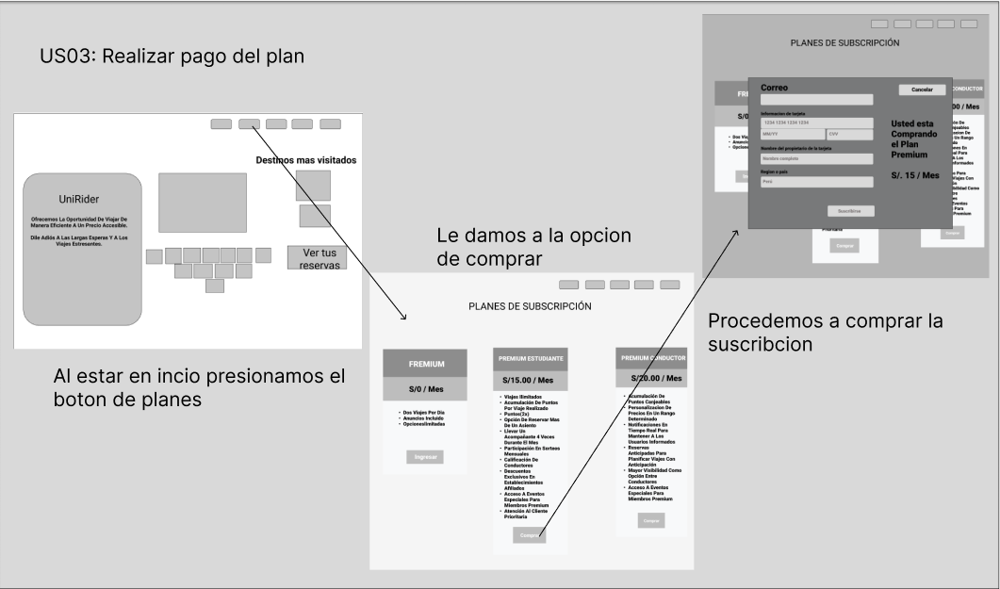

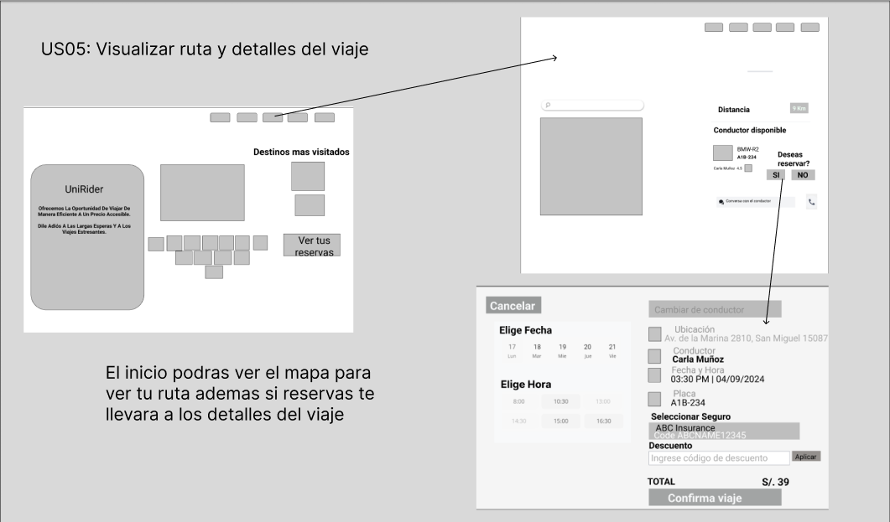


### [**4.4.3. Web Applications Mock-ups.**](#web-applications-mock-ups)


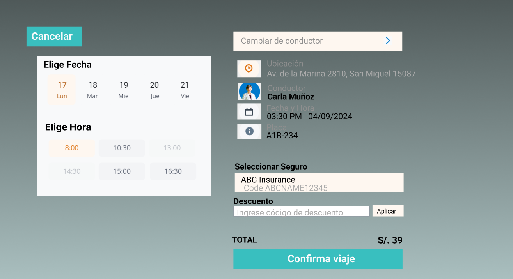


**Mobile Application.**


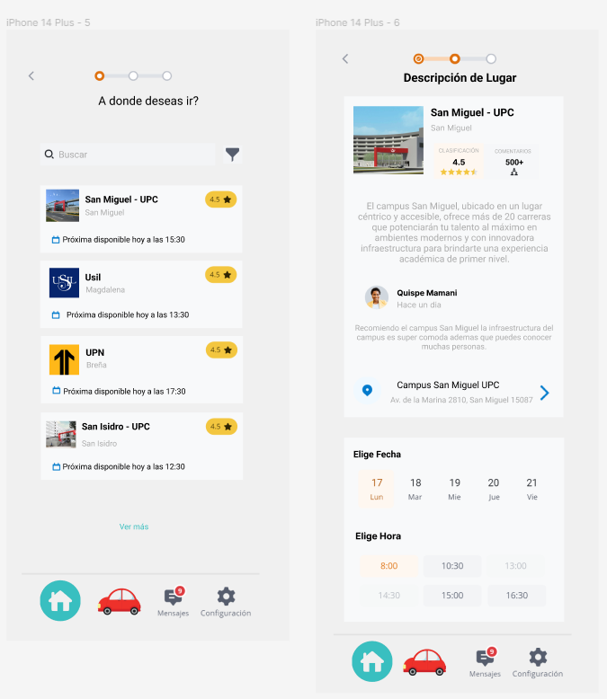


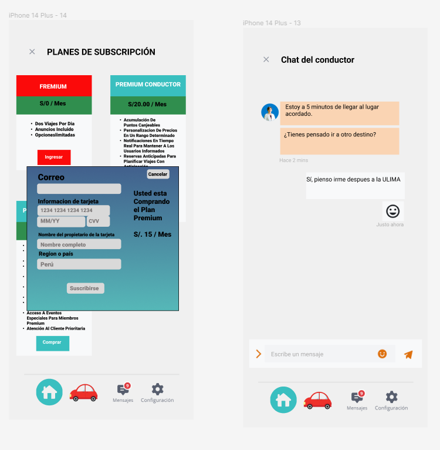
### [**4.4.4. Web Applications User Flow Diagrams.**](#web-applications-user-flow-diagrams)

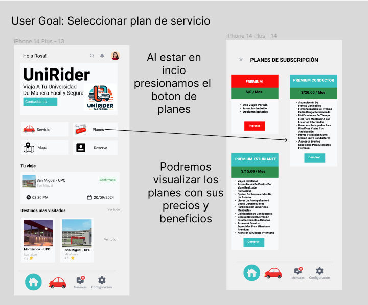

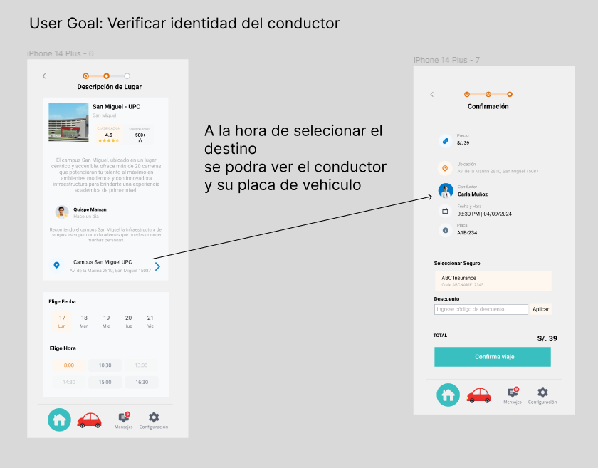
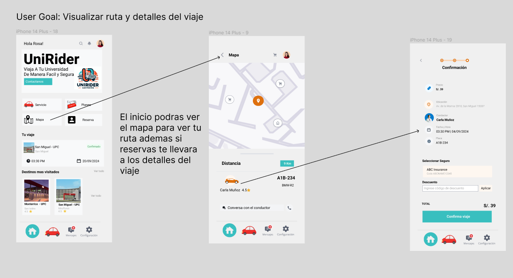


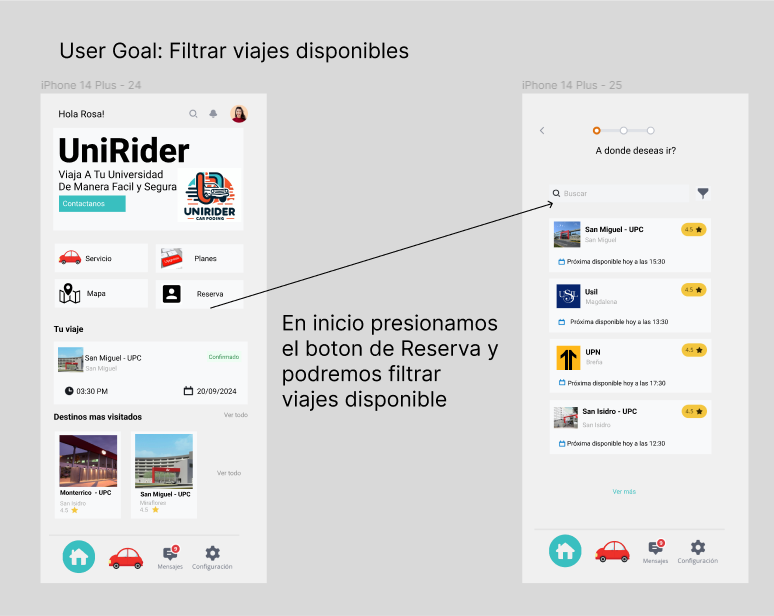
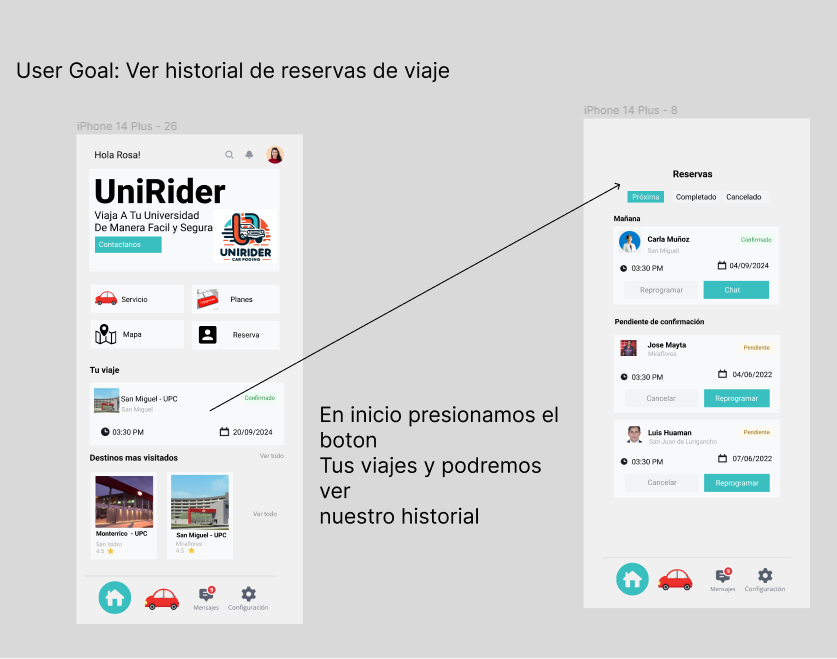

## [**4.5. Web Applications Prototyping.**](#web-applications-prototyping)
[**Figma Web Application**](https://www.figma.com/proto/EwjGSJ6rrm0CnMdTbftA6k/Web-Application-Wireframe-%2F-Mock-Up?type=design&node-id=15-482&t=ujEphZo6qTextt9h-1&scaling=min-zoom&page-id=0%3A1&starting-point-node-id=15%3A482&mode=design)


[**Figma Mobile Application**](https://www.figma.com/proto/PvLdtSaENiMYY9cQT6YMat/App-celular?type=design&node-id=11-2&t=ov9bcksZvKFHrT8j-0&scaling=min-zoom&page-id=0%3A1)

## [**4.6. Domain-Driven Software Architecture**](#domain-driven-software-architecture)
### [**4.6.1. Software Architecture Context Diagram.**](#software-architecture-context-diagram)


### [**4.6.2. Software Architecture Container Diagrams.**](#software-architecture-container-diagrams)


### [**4.6.3. Software Architecture Components Diagrams.**](#software-architecture-components-diagrams)

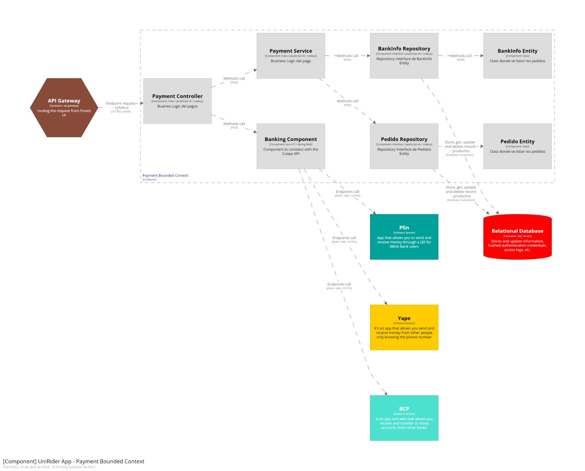


## [**4.7. Software Object-Oriented Design.**](#software-object-oriented-design)
### [**4.7.1. Class Diagrams.**](#class-diagrams)


### [**4.7.2. Class Dictionary.**](#class-dictionary)
Class Usuario

| attribute         | Type       |Description|
|------------------|------------|-----------|
| name           | string     | User name |
| lastname         | string     | user's last name|
| id              | int        | way to identify the user|
| useraccount     | Cuenta     | User profile |
| registrationUser | Matricula  | the user's registration |
| wallet        | Billetera  | funds to pay for travel |
| record        | Registro[] | You will be able to see the trips you make |
| phonenumber    | int       | way to contact the user|
|notifications    | Notificacion[]| send messages to the user |

Class Registro

| attribute         | Type       |Description|
|------------------|------------|-----------|
|driverid      | int        |way to identify the driver|
|start|time|registration home page|
|origin|string|starting place|
|destination|string|requested trip|
|price|float|travel cost|
|typepay|string|payment methods|

Class Notificacion

| attribute     | Type       |Description|
|--------------|------------|-----------|
| message      |string|event received by the user|
| dateissue |time|date the notification came out|
|type         |string|type of message|

Class Billetera

| attribute     | Type       |Description|
|--------------|------------|-----------|
|cards         |Card[]|registered card|
|Digitalwalletnumber|int|if you have more wallets|

Class Card

| attribute   | Type   |Description|
|------------|--------|-----------|
| cardNumber | string |user card number|
| csv        | int    |3 numbers back|
| date       | time   |card expiration date|

Class Cuenta

| attribute     | Type   |Description|
|--------------|--------|-----------|
|mail        | string |way for reminders to arrive|
|password    | string |user account password|

Class Matricula

| attribute         | Type      |Description|
|------------------|-----------|-----------|
| Institute        |string   |user's institute name|
| codeStudent | int       |way to identify the user within your institution|

Class Instituto

| attribute         | Type      |Description|
|------------------|-----------|-----------|
| name           | string    |Name of the Institution|
| adress        | string    |institution address|
| status           | string    |academic level of the institution|
|   type   | string    |If it is an institute or university|


Class Condutor

| attribute         | Type      |Description|
|------------------|-----------|-----------|
|route             | Route      |driver's route|
|license          | License  |valid driver's license|

Class Ruta

| attribute         | Type      |Description|
|------------------|-----------|-----------|
| origin           | string    |driving road|
| destination          | string    |travel destination|
|Specifications  | string    |details of the trip|

Class Licencia

| attribute       | Type      |Description|
|----------------|-----------|-----------|
| licensenumber | int       |driver's license number|
| class          | string    |license class type|
| category       | string    |license category type|
| expirationdate | Time      |license expiration date|

Class Auto

| attribute         | Type      |Description|
|------------------|-----------|-----------|
|VehicleRegistration|RegistroVehicular|vehicle registration|
|insurance           | Insurance    |vehicle insurance|

Class RegistroVehicular

| attribute         | Type      |Description|
|------------------|-----------|-----------|
|plate            | string    |Vehicle plate|
|ownername | string   |name of the vehicle owner|
|lastnameOwner | string  |last name of the vehicle owner|


Class Seguro

| attribute         | Type   |Description|
|------------------|--------|-----------|
|id| int    |ID for insurance|
|expedition| string |insurance issuance|
|plan| string |insurance plans obtained|

## [**4.8. Database Design.**](#database-design)
### [**4.8.1. Database Diagram.**](#database-diagram)

Para este proyecto se optó por escoger el motor de base de datos de MySQL, para almacenar y gestionar la información de nuestros usuarios, los vehículos, el instituto al que pertenecen entre otros varios. Este motor permite expandir los recursos utilizados en la base de datos del proyecto según las necesidades y requerimientos del negocio. 


# [**Capítulo V: Product Implementation, Validation \& Deployment.**](#capítulo-v-product-implementation-validation--deployment)
## [**5.1. Software Configuration Management.**](#software-configuration-management)
### [**5.1.1. Software Development Environment Configuration.**](#software-development-environment-configuration)

**Project Management:**

* _Notion_: Notion es una herramienta de gestión de proyectos que permite a los equipos colaborar en tiempo real, organizar tareas y compartir información de manera eficiente. En UniRider, utilizamos Notion para planificar y monitorear el progreso de nuestro proyecto, asignar tareas a los miembros del equipo y mantenernos organizados en todo momento. La interfaz intuitiva y las funciones personalizables de Notion nos permiten adaptar la herramienta a nuestras necesidades específicas y garantizar una gestión eficaz de nuestro proyecto. https://www.notion.so/es-es

**Requirements Management**

* _Miro_: Miro es una herramienta de colaboración en línea que permite a los equipos trabajar de forma conjunta en la creación de diagramas, mapas mentales, prototipos y otros tipos de contenido visual. En UniRider, utilizamos Miro para realizar sesiones de lluvia de ideas, diseñar flujos de trabajo y diagramas de arquitectura, y colaborar en la creación de prototipos de nuestra aplicación web. La funcionalidad de colaboración en tiempo real de Miro nos permite trabajar de forma conjunta en la creación y edición de contenido visual, lo que facilita la comunicación y la toma de decisiones en el equipo. https://miro.com/

**Product UX/UI Design**

* _Figma_: Figma es una herramienta de diseño de interfaz de usuario basada en la nube que permite a los equipos colaborar en tiempo real, crear prototipos interactivos y diseñar interfaces de usuario de alta calidad. En UniRider, utilizamos Figma para diseñar y prototipar la interfaz de usuario de nuestra aplicación web, lo que nos permite visualizar y compartir nuestras ideas de diseño de manera efectiva. La funcionalidad de colaboración en tiempo real de Figma nos permite trabajar de forma conjunta en el diseño de la aplicación, recopilar comentarios y realizar ajustes en tiempo real. https://www.figma.com/
<br><br>
* _Lucidchart_: Lucidchart es una herramienta de diagramación en línea que permite a los equipos crear diagramas, organigramas, mapas mentales y otros tipos de diagramas de manera colaborativa. En UniRider, utilizamos Lucidchart para crear diagramas de flujo, diagramas de arquitectura de software y otros diagramas relacionados con el diseño y desarrollo de nuestra aplicación web. La funcionalidad de colaboración en tiempo real de Lucidchart nos permite trabajar de forma conjunta en la creación y edición de diagramas, lo que facilita la comunicación y la toma de decisiones en el equipo. https://www.lucidchart.com/

**Software Testing**

* _Gherkin_: Gherkin es un lenguaje de especificación de comportamiento que se utiliza para escribir pruebas de aceptación en un formato legible por humanos. En UniRider, utilizamos Gherkin para definir los criterios de aceptación de nuestras historias de usuario y escenarios de prueba, lo que nos permite validar el comportamiento de nuestra aplicación web de manera sistemática y eficiente. La sintaxis simple y estructurada de Gherkin nos permite describir el comportamiento esperado de la aplicación de forma clara y concisa, lo que facilita la colaboración entre los miembros del equipo y garantiza la calidad del software. https://cucumber.io/docs/gherkin/

**Software Development**

* _Visual Studio Code_: Visual Studio Code es un editor de código ligero y altamente personalizable que ofrece una amplia gama de funciones y extensiones para facilitar el desarrollo de software. En UniRider, utilizamos Visual Studio Code como nuestro entorno de desarrollo integrado (IDE) para escribir, depurar y probar el código de nuestra aplicación web. La interfaz intuitiva y las funciones avanzadas de Visual Studio Code nos permiten trabajar de manera eficiente y productiva, lo que nos ayuda a mantener un alto nivel de calidad en nuestro código y acelerar el proceso de desarrollo. https://code.visualstudio.com/
<br><br>
* _Structurizr_: Structurizr es una plataforma en línea que permite a los equipos documentar y visualizar la arquitectura de software de sus aplicaciones de forma colaborativa. En UniRider, utilizamos Structurizr para crear diagramas de arquitectura de software que representan la estructura y los componentes de nuestra aplicación web, lo que nos permite comunicar de manera efectiva la arquitectura de nuestro sistema a los miembros del equipo y otras partes interesadas. La funcionalidad de colaboración en tiempo real de Structurizr nos permite trabajar de forma conjunta en la creación y edición de diagramas, lo que facilita la comprensión y el mantenimiento de la arquitectura de nuestro software. https://structurizr.com/
<br><br>
* _HTML_: HTML (HyperText Markup Language) es el lenguaje de marcado estándar utilizado para crear y diseñar páginas web. En UniRider, utilizamos HTML para estructurar y organizar el contenido de nuestra aplicación web, lo que nos permite definir la jerarquía de los elementos y la presentación visual de la interfaz de usuario. La sintaxis simple y estructurada de HTML nos permite crear páginas web interactivas y receptivas que se adaptan a diferentes dispositivos y tamaños de pantalla, lo que garantiza una experiencia de usuario consistente y de alta calidad. https://developer.mozilla.org/en-US/docs/Web/HTML
<br><br>
* _CSS_: CSS (Cascading Style Sheets) es un lenguaje de diseño utilizado para definir la apariencia y el estilo visual de las páginas web. En UniRider, utilizamos CSS para personalizar y dar formato al contenido de nuestra aplicación web, lo que nos permite controlar la tipografía, los colores, los márgenes y otros aspectos visuales de la interfaz de usuario. La sintaxis simple y flexible de CSS nos permite crear estilos personalizados y responsivos que se adaptan a diferentes dispositivos y tamaños de pantalla, lo que garantiza una presentación visual atractiva y coherente en nuestra aplicación. https://developer.mozilla.org/en-US/docs/Web/CSS
<br><br>
* _JavaScript_: JavaScript es un lenguaje de programación de alto nivel utilizado para crear interactividad y dinamismo en las páginas web. En UniRider, utilizamos JavaScript para agregar funcionalidades interactivas y dinámicas a nuestra aplicación web, lo que nos permite crear formularios interactivos, animaciones y efectos visuales que mejoran la experiencia de usuario. La sintaxis flexible y versátil de JavaScript nos permite desarrollar aplicaciones web complejas y sofisticadas que se ejecutan en el navegador del usuario, lo que garantiza una interacción fluida y atractiva con nuestra aplicación. https://developer.mozilla.org/en-US/docs/Web/JavaScript

**Software Deployment**

* _Git_: Git es un sistema de control de versiones distribuido que permite a los equipos colaborar en el desarrollo de software, realizar un seguimiento de los cambios en el código y gestionar las versiones de los archivos de forma eficiente. En UniRider, utilizamos Git como nuestra herramienta de control de versiones para mantener un historial de los cambios en el código de nuestra aplicación web, lo que nos permite colaborar en el desarrollo de software de forma segura y eficaz. La funcionalidad de ramificación y fusión de Git nos permite trabajar en paralelo en diferentes funciones y características de la aplicación, lo que facilita la colaboración entre los miembros del equipo y garantiza la integridad y la calidad del código. https://git-scm.com/

**Software Documentation and Project Management**

* _GitHub_: GitHub es una plataforma en línea que permite a los equipos colaborar en el desarrollo de software, alojar repositorios de código y gestionar proyectos de forma eficiente. En UniRider, utilizamos GitHub como nuestra plataforma de desarrollo de software para alojar el código fuente de nuestra aplicación web, realizar un seguimiento de los cambios en el código y gestionar las tareas y problemas del proyecto. La funcionalidad de control de versiones y colaboración de GitHub nos permite trabajar de forma conjunta en el desarrollo de software, lo que facilita la comunicación y la coordinación entre los miembros del equipo y garantiza la calidad y la integridad del código. https://github.com/

### [**5.1.2. Source Code Management.**](#source-code-management)

|Integrantes| Cuenta de GitHub      |
|----------|-----------------------|
|Agama Espinoza, Eric Fabrizio	| U202213358@upc.edu.pe |
|Anampa Lavado, Luis Angel| U202218664@upc.edu.pe |
|Cortez Flores, Ely Rivaldo| U202215313@upc.edu.pe |
|Mayta Lopez, Harold Jaime| U202114851@upc.edu.pe |
|Pardo Zapata, Gustavo Adolfo	| U202120347@upc.edu.pe |

**Despliegues**
URL Landing Page desplegada:

**Repositorios**
URL del repositorio de Landing Page:

URL del repositorio del Reporte Final:

**Implementacion de Gitflow**

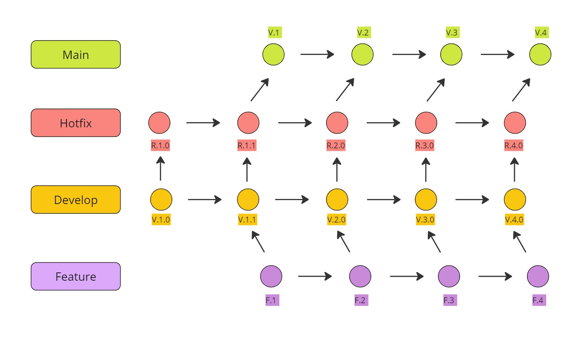

Gitflow es un modelo de ramificación para Git que se centra en la organización de las ramas de un proyecto de software. El modelo de Gitflow define una serie de ramas estándar y reglas para su uso, lo que facilita la colaboración y la gestión del código en un equipo de desarrollo. En UniRider, utilizamos el modelo de Gitflow para organizar y gestionar las ramas de nuestro proyecto, lo que nos permite trabajar de forma eficiente y colaborativa en el desarrollo de nuestra aplicación web.

La rama **main** es la rama principal de nuestro proyecto, que contiene la versión estables, operativas y listas para implementar de UniRider. Estas variantes han sido previamente evaluadas y se ha verificado la total funcionalidad de estas tras su implementación. Emplearemos etiquetas para identificar cada variante estable y lista para implementar, lo que nos permitirá tener un seguimiento preciso de las variantes y simplificar la administración de futuras actualizaciones.

La rama **develop** es la rama de desarrollo de nuestro proyecto, que contiene la versión en desarrollo de UniRider que aún no han sido sometidas a pruebas, aunque están completadas al 100% y contienen todas las características que se esperan hasta ese momento. Este canal se emplea para cargar la versión y llevar a cabo pruebas finales con el fin de corregir cualquier inconveniente antes de la publicación final en la rama main.

La rama **feature** es la rama de características de nuestro proyecto, que contiene las nuevas características y funcionalidades que se están desarrollando para UniRider. Cada nueva característica se desarrolla en una rama de características separada, lo que permite a los miembros del equipo trabajar de forma independiente en diferentes aspectos de la aplicación y facilita la integración de las nuevas características en la rama de desarrollo.


### [**5.1.3. Source Code Style Guide \& Conventions.**](#source-code-style-guide--conventions)

En esta sección, se establece y documenta la guía de estilo y las convenciones de codificación que deben seguirse en el proyecto.Estas convenciones se aplicarán a los diversos lenguajes utilizdos como HTML,CSS y Gherkin.Se prefiere que toda la nomenclatura y la documentación se realicen en inglés.

### HTML
- Se debe cerrar cada elemento HTML adecuadamente.
- Utilizar minúsculas para los nombres de elementos y atributos.
- Emplear comillas alrededor de los valores de los atributos, especialmente cuando incluyan espacios.
- Especificar el texto alt y las dimensiones width y height para todas las imágenes.

### CSS
- Utilizar nombres de clases descriptivos y breves.
- Separar los nombres de las clases e ID con un guion (-).
- Evitar especificar la unidad de medida para valores de 0.
- Separar declaraciones y selectores en nuevas líneas para mejorar la legibilidad.

### JavaScript
- Utilizar nombres de variables y funciones descriptivos.
- Organizar el código en bloques lógicos separados con una indentación de 2 espacios.
- Utilizar operadores de comparación estricta (===) en lugar de igualdad débil (==) siempre que sea posible.
- Utilizar punto y coma al final de cada declaración.
- Mantener comentarios para explicar el propósito y la funcionalidad del código.

### Gherkin
- Utilizar los bloques Given, When, y Then para estructurar los escenarios.
- Separar escenarios con dos líneas en blanco.
- Utilizar palabras clave significativas y descriptivas.
- Usar saltos de línea para mejorar la legibilidad y agrupar información.

### [**5.1.4. Software Deployment Configuration.**](#software-deployment-configuration)    

En este trabajo utilizaremos Git y Github

**Git**: Git es un sistema de control de versiones distribuido muy utilizado en el desarrollo de software, concebido por Linus Torvalds en 2005. Ha evolucionado hasta convertirse en una herramienta esencial para la colaboración y el seguimiento de cambios en proyectos, tanto de código abierto como privados. Una de sus ventajas principales radica en su capacidad para registrar los cambios en los archivos de un proyecto a lo largo del tiempo. Los desarrolladores pueden crear ramas, realizar modificaciones en estas y fusionarlas de manera eficiente, permitiendo así el trabajo simultáneo en diferentes aspectos del proyecto sin interferencias.

El modelo distribuido de Git garantiza que cada desarrollador tenga una copia completa del repositorio, incluyendo su historial de cambios, lo que otorga flexibilidad y seguridad. Los cambios pueden compartirse y sincronizarse a través de repositorios remotos como GitHub, facilitando la colaboración en equipo. Además, Git proporciona una serie de características y comandos que simplifican la gestión de versiones, como la creación de ramas para nuevas funcionalidades o correcciones de errores sin afectar la rama principal, así como la capacidad de revertir cambios y rastrear versiones anteriores, útil para corregir errores o realizar cambios retrospectivos.

Su utilidad reside en el control detallado de las herramientas del software, permitiendo almacenar diferentes versiones a lo largo de las distintas etapas del proyecto. Esto posibilita a los desarrolladores hacer un seguimiento de lo realizado y resolver problemas o realizar cambios según sea necesario durante el desarrollo del proyecto.


**Github**: GitHub es una plataforma de alojamiento y colaboración de código fuente construida sobre Git, que fue lanzada en 2008 y ha alcanzado gran popularidad entre desarrolladores de todo el mundo. En este entorno, los desarrolladores pueden crear repositorios para almacenar y administrar su código fuente, los cuales pueden ser públicos o privados, dependiendo de la naturaleza del proyecto.

Destacándose por su capacidad para fomentar la colaboración en equipo, GitHub permite que múltiples desarrolladores trabajen simultáneamente en el mismo repositorio, realizando cambios en diferentes ramas y fusionándolos de manera sencilla. Esto simplifica la gestión conjunta y la integración de contribuciones diversas. Además de su función principal como plataforma de gestión de código fuente, GitHub ofrece una serie de herramientas adicionales. Entre estas se incluyen los "issues", que permiten realizar un seguimiento de tareas, errores o mejoras necesarias en el proyecto, y los "pull requests", que facilitan la revisión y fusión de cambios propuestos por colaboradores externos antes de su incorporación al repositorio principal.

Otro aspecto destacado de GitHub son las "actions", que posibilitan la automatización de tareas y flujos de trabajo en el proyecto, tales como la ejecución de pruebas, la generación de documentación o la implementación continua. GitHub también se destaca por su activa comunidad y su compromiso con el código abierto, albergando numerosos proyectos de esta índole, lo que promueve la colaboración y la transparencia en el desarrollo de software.

Esta plataforma, que complementa la funcionalidad de Git, permite mantener repositorios de código en almacenamiento basado en la nube, facilitando el trabajo colaborativo al permitir que múltiples colaboradores trabajen en un mismo proyecto, visualizando las ediciones individuales de cada integrante y mejorando así la eficiencia del trabajo en equipo.

## [**5.2. Landing Page, Services \& Applications Implementation.**](#landing-page-services--applications-implementation)
### [**5.2.1. Sprint 1.**](#sprint-1)
#### [**5.2.1.1. Sprint Planning 1.**](#sprint-planning-1)
| Sprint 1                         | Implementación de funcionalidades y diseño de la aplicación.|
| -------------------------------- | ----------------------------------------------------------- |
| Sprint Planning Background       |
| Date                             | 09/04/2024|
| Time                             | 22:00 horas (GMT-5)|
| Location                         | Reunión realizada mediante Discord|
| Prepared By                      | Mayta Lopez, Harold Jaime	|
| PAttendees (to planning meeting) | <li>Mayta Lopez, Harold Jaime</li>	 <li>Agama Espinoza, Eric Fabrizio </li> <li>Cortez Flores, Ely Rivaldo  </li> <li>Pardo Zapata, Gustavo Adolfo </li> <li>Anampa Lavado, Luis Angel </li>|
|Sprint n -1 Review|
|Resumen|Se creará la organización de UniRider en Github y el repositorio de la organización. |
|Sprint n -1 Retrospective|
|Resumen|Se implemento para el landing se ha realizado mediante html css y js.|
| **Sprint Goal & User Stories**   |
| Sprint 1 Velocity                |  21 points|
| Sum of Story Points              |  21 points|

#### [**5.2.1.2. Sprint Backlog 1.**](#sprint-backlog-1)

| id   | Title                  | Id  | Title                                                    | Description                                                                                                   | Estimations(Hours) | Assigned To   | Status(To-do /InProcess/ToReview/Done) |
| ---- | ---------------------- | --- | -------------------------------------------------------- | ------------------------------------------------------------------------------------------------------------- | ------------------ | ------------- | -------------------------------------- |
| GW01 | Apartado del Header  | G01 | Header responsivos (Desarrollado en HTML y CSS).| Desarrollo e implementación de los estilos que corresponden al encabezado (Header). Debe ser responsive.      | 3| Ely Cortez  | Done|
| GW02 | Apartado del Footer    | G02 | Footer responsivos (Desarrollado en HTML y CSS).| Desarrollo e implementación de los estilos que corresponden al pie de página (Footer). Debe ser responsive.   | 2| Gustavo Pardo | Done|
| GW03 | Apartado Home          | G03 | (Desarrollado en HTML y CSS)| Desarrollo e implementación de los estilos que corresponden a la sección Home. Debe ser responsive.           | 3|  Harold Mayta  | Done|
| GW04 | Apartado Producto   | G04 | (Desarrollado en HTML y CSS)| Desarrollo e implementación de los estilos que corresponden a Producto. Debe ser responsive.    | 2| Erick Agama   | Done|
| GW05 | Apartado contacto          | G05 | Sección "Contacto"(Desarrollado en HTML y CSS)| Desarrollo e implementación de los estilos que corresponden a la sección Testimonios. Debe ser responsive.    | 3|  Harold Mayta  | Done|
| GW06 | Sección Sobre equipo | G06 | Información del equipo (Desarrollado en HTML y CSS)| Desarrollo e implementación de los estilos que corresponden a la información del equipo. Debe ser responsive. | 3|Ely Cortez | Done|
| GW07 | Apartado planes     | G07 | Funcionalidad de los Botones(Desarrollado en HTML y CSS) | Desarrollo e implementación de los estilos que corresponden a los planes de la página. Debe ser responsive.  | 3| Luis Anampa | Done|
| GW08 | Apartado encabezado    | G08 | Desarrollo responsive de la página| Desarrollo e implementación de un estilo responsive en toda la página.| 2| Luis Anampa  | Done|
#### [**5.2.1.3. Development Evidence for Sprint Review.**](#development-evidence-for-sprint-review)

| Repository   | Branch                                      | Commit Id | Commit Message                   | Commit Message Body | Commited on (Date) |
| ------------ | ------------------------------------------- | --------- | -------------------------------- | ------------------- | ------------------ |
| landing-page |feature/index.html|759cc14| feat: (Landing page ) header| -| 10/04/2024         |
| landing-page |feature/index.html|40c7f15| feat: (landingPage) added header and navbar| -| 10/04/2024|
| landing-page |feature/index.html|abdd069| feat: add Home| -| 10/04/2024|
| landing-page |feature/index.html|ea53c5f| feat: (Landing page) added About us| -| 10/04/2024|
| landing-page |feature/index.html|f269ea5| feat: (Landing Page) implement product section| -|10/04/2024|
| landing-page |feature/index.html|076717c| Feat: (Landing page) plans section| -|10/04/2024|
| landing-page |feature/index.html|bc1bc4a| feat: (landingPage) add team section| -|10/04/2024|
| landing-page |feature/index.html|166d6a4|feat: (Landing Page) add contact section| -|10/04/2024|
| landing-page |feature/index.html|6371146| feat: (Landing page) add Footer section| -|10/04/2024|
| landing-page |feature/index.html|02f2eld| feat: (Landing Page) implement responsive| -|10/04/2024|


#### [**5.2.1.4. Testing Suite Evidence for Sprint Review.**](#testing-suite-evidence-for-sprint-review)

Para la entrega del Sprint 1 se intentó alcanzar el desarrollo completo, implementación y despliegue del Landing Page. Es por ello que la sección de "Testing" se centro en la implementación de los archivos feature que contiene nuestro landing page.


#### [**5.2.1.5. Execution Evidence for Sprint Review.**](#execution-evidence-for-sprint-review)

En el sprint 1 se alcanzo un desarrollo parcial en la implementación del despliegue del landing page. La cual muestra diferentessecciones donde el usuario puede encontrar información relevante acerca del producto y del start up. A continuación semuestran algunas evidencias:

- Sección planes: En la sección planes, el usuario puede visualizar e interactuar con los diferentes planes que ofrecemos.
  
  
- Sección contacto: En la sección contacto el usuario puede introducir su información para que la empresa se ponga en contacto con ellos, oen su defecto, ingresar a los medio de comunicación de la empresa


- Sección about: En la sección about , el usuario podra observar nuestro Start Up y nuestras fortalezas
  


- Sección Funciones: En la sección Funciones el usuario podra encontrar todas las funciones con las que vamos a contar.
  


#### [**5.2.1.6. Services Documentation Evidence for Sprint Review.**](#services-documentation-evidence-for-sprint-review)

Este primer Sprint solo trata la implementación del landing page, por lo que no se empleó ningún servicio adicional.

#### [**5.2.1.7. Software Deployment Evidence for Sprint Review.**](#software-deployment-evidence-for-sprint-review)

Para la entrega del Sprint número 1, se desplego el landing page parcialmente completa. 

https://lading-page-deploit.vercel.app/

#### [**5.2.1.8. Team Collaboration Insights during Sprint.**](#team-collaboration-insights-during-sprint)

Para la realización de los commits de nuestro primer Sprint, hemos hecho uso de la herramienta Visual Studio Code, además del uso de Git. Uno de los integrantes realizó un primer commit para la creación del repositorio, luego utilizando Git clonamos el repositorio, para luego realizar los cambios en Visual Code y crear los branches correspondientes a dichos cambios, para finalmente realizar el commit, el cual deberá ser revisado dentro del repositorio de Github.

https://github.com/rivacortez/landingPage-UniRider/tree/landingpage.final


### [**5.2.2. Sprint 2.**](#sprint-2)
#### [**5.2.2.1. Sprint Planning 2.**](#sprint-planning-2)
| Sprint 2                         | Desarrollo del Frontend.|
| -------------------------------- | ----------------------------------------------------------- |
| Sprint Planning Background                                                                     |
| Date                             | 28/04/2024|
| Time                             | 22:00 horas (GMT-5)|
| Location                         | Reunión realizada mediante Discord|
| Prepared By                      | Mayta Lopez, Harold Jaime	|
| Attendees (to planning meeting) | <li>Mayta Lopez, Harold Jaime</li>	 <li>Agama Espinoza, Eric Fabrizio </li> <li>Cortez Flores, Ely Rivaldo  </li> <li>Pardo Zapata, Gustavo Adolfo </li> <li>Anampa Lavado, Luis Angel </li>|
|Resumen|Se diseña e implementa el apartado de frontend. |
|US Y metas para este sprint|
| US abarcados<br>(Sprint 2)   |**US-01 (3 point)**<br>Visualizar Inicio de registro:Como Usuario Quiero poder crear mi usuario Para acceder al servicio de carpooling. <br>**US-02 (3 points)**<br>Seleccionar planes de servicio:Como Usuario Quiero seleccionar un plan de servicio Para adquirir los beneficios ofrecidos.<br>**US-03 (5 points)**<br>Realizar pago del plan: Como Usuario Quiero realizar el pago del plan seleccionado Para activar los beneficios ofrecidos.<br>**US-08 (3 points)**<br>VFiltrar viajes disponibles:Como Usuario Quiero poder filtrar los viajes disponibles Para encontrar opciones que se ajusten a mis preferencias.<br>**US-07 (5 points)**<br>Brindar calificaciones:Como Usuario Quiero brindar calificaciones a los conductores designados Para mejorar la experiencia de otros usuarios.<br>**US-09 (3 points)**<br>Ver historial de reservas de viaje: Como Usuario Quiero poder ver mi historial de reservas de viaje Para tener un registro de mis viajes anteriores y cancelaciones.<br>**US-04 (3 points)**<br>Verificar identidad del conductor:Como Usuario Quiero verificar la identidad del conductor Para garantizar mi seguridad durante el viaje.<br>**US-05 (3 points)**<br>Visualizar ruta y detalles del viaje:Como Usuario Quiero ver la ruta y los detalles del viaje Para prepararme adecuadamente y saber qué esperar.<br>**US-06 (8 points)** <br>Establecer Ruta y Horario de viaje: Como Usuario Quiero establecer la ruta y el horario de mi viaje Para planificar y compartir adecuadamente mi viaje.|
|Goals to achive|**Meta principal**<br> Desarrollar el Frontend Web Application de nuestro proyecto UniRider, el cual cumpla con ser interactico para los usuarios.<br>**Metas especificas**<br> <li>Diseño del formulario de registro y pagina principal </li> <li>Implementacion de la pagina de planes de servicio </li> <li>Integracion de un proceso de compra el cual pida datos esenciales para el proceso </li> <li>Diseño y muestra de la identidad del conductor </li><li>Implementacion del acceso a detalles del viaje y ver las rutas </li> <li>Implemenacion de un proceso que permita establecer una ruta y horario del viaje del usuario </li> <li>Poder filtrar viajes disponibles </li> <li>Implementacion de la pagina de historial de reservas </li>|
| Sprint 2 Velocity                |  36 points|
| Sum of Story Points              |  36 points|

#### [**5.2.2.2. Sprint Backlog 2.**](#sprint-backlog-2)
</table>
  <table border="1">
  <tr>
    <th>ID</th>
    <th>Title</th>
    <th>Id</th>
    <th>Title</th>
    <th>Description</th>
    <th>Estimation (Hours)</th>
    <th>Assigned To</th>
    <th>Status (To-do / In-Process / To-Review / Done)</th>
  </tr>
  <tr>
    <td rowspan="3"> 1</td>
    <td rowspan="3">US01:Visualizar el inicio de registro</td>
    <td>1.1</td>
    <td>Diseño del formulario de registro</td>
    <td>Diseñar la interfaz del fomulario de registro de usuario</td>
    <td> 8 hours</td>
    <td>Angel</td>
    <td>Done</td>
  </tr>
   <tr>
    <td>1.2</td>
    <td>Desarrollo del formulario de registro</td>
    <td>Desarrollar la logica para el formulario de registro de usuario</td>
    <td> 12 hours</td>
    <td>Angel</td>
    <td>Done</td>
  </tr>
  <tr>
    <td>1.3</td>
    <td>Diseño de la pagina principal o Menu de incio</td>
    <td>Diseñar la interfaz de usuario cuando se encuentre en el menu principal de la web aplication</td>
    <td> 8 hours</td>
    <td>Ely Cortez</td>
    <td>Done</td>
  </tr>
<tr>
    <td rowspan="3"> 2 </td>
    <td rowspan="3">US02:Visualizar y seleccionar planes de servicio</td>
    <td>2.1</td>
    <td>Diseño de la pagina de visualización de planes de servicio</td>
    <td>Diseñar la interfaz de usuario para la visualización de planes de servicio</td>
    <td> 10 hours</td>
    <td>Ely Cortez</td>
    <td>Done</td>
  </tr>
   <tr>
    <td>2.2</td>
    <td>Diseño de la pagina de selección de plan de servicio</td>
    <td>Diseñar la interfaz de usuario cuando selecciona la opcion de plan de servicio</td>
    <td> 10 hours</td>
    <td>Eric</td>
    <td>Done</td>
  </tr>
  <tr>
    <td>2.3</td>
    <td>Implementación de la funcionalidad de seleccion de plan de servicio</td>
    <td>Desarrollar la logica para seleccionar un plan de servicio</td>
    <td> 10 hours</td>
    <td>Eric</td>
    <td>Done</td>
  </tr>
<tr>
    <td rowspan="2"> 3 </td>
    <td rowspan="2">US03:Diseño de la pagina de pago de plan de servicio</td>
    <td>3.1</td>
    <td>Diseño de la pagina de pago de plan de servicio</td>
    <td>Diseñar la interfaz de usuario para realizar el pago del plan se servicio</td>
    <td> 8 hours</td>
    <td> Gustavo </td>
    <td>Done</td>
  </tr>
   <tr>
    <td>3.2</td>
    <td>Implementación de la funcionalidad de pago del plan de servicio</td>
    <td>Desarrollar la lógica para procesar el pago del plan de servicio</td>
    <td> 12 hours</td>
    <td> Eric</td>
    <td>To-do</td>
  </tr>
<tr>
    <td rowspan="2"> 4 </td>
    <td rowspan="2">US04:Verificar la identidad del conductor</td>
    <td>4.1</td>
    <td>Diseño de la pagina de verificación de identidad del condcutor</td>
    <td>Diseñar la interfaz de usuario para verificar la identidad del conductor</td>
    <td> 6 hours</td>
    <td> Eric </td>
    <td>Done</td>
  </tr>
   <tr>
    <td>4.2</td>
    <td>Implementación de la funcionalidad de verificación de identidad del conductor</td>
    <td>Desarrollar la logica para verificar la identidad del conductor</td>
    <td> 10 hours</td>
    <td> Eric   </td>
    <td>To do</td>
  </tr>  
<tr>
    <td rowspan="2"> 5 </td>
    <td rowspan="2">US05:Visualizar ruta y detalles del viaje</td>
    <td>5.1</td>
    <td>Diseño de la pagina de visualización de ruta y detalles del viaje</td>
    <td>Diseñar la interfaz de usuario para mostrar la ruta y los detalles del viaje</td>
    <td> 6 hours</td>
    <td> Harold </td>
    <td>Done</td>
  </tr>
   <tr>
    <td>5.2</td>
    <td>Implementación de la funcionalidad de visualización de ruta y detalles del viaje</td>
    <td>Desarrollar la lógica para mostrar la ruta y los detalles del viaje</td>
    <td> 8 hours</td>
    <td> Harold   </td>
    <td>To-do</td>
  </tr>
<tr>
    <td rowspan="2"> 6 </td>
    <td rowspan="2">US06:Establecer ruta y horario del viaje</td>
    <td>6.1</td>
    <td>Diseño de la pagina de establecimiento de ruta y horario de viaje</td>
    <td>Diseñar la interfaz de usuario para establecer la ruta y el horario de viaje</td>
    <td> 8 hours</td>
    <td> Angel </td>
    <td>To-do</td>
  </tr>
   <tr>
    <td>6.2</td>
    <td>Implementacion de la funcionalidad de establecimiento de ruta y horario de viaje</td>
    <td>Desarrollar la logica para establecer los parametros solicitados</td>
    <td> 10 hours</td>
    <td> Angel  </td>
    <td>To-do</td>
  </tr> 
<tr>
    <td rowspan="2"> 7 </td>
    <td rowspan="2">US07:Brindar calificaciones</td>
    <td>7.1</td>
    <td>Diseño de la pagina de calificacion de conductores</td>
    <td>Diseñar la interfaz de usuario para calificar a los conductores</td>
    <td> 8 hours</td>
    <td> Harold </td>
    <td>Done</td>
  </tr>
   <tr>
    <td>7.2</td>
    <td>Implementacion de la funcionalidad de calificación de conductor</td>
    <td>Desarrollar la lógica para calificar a los conductores</td>
    <td> 12 hours</td>
    <td> Harold   </td>
    <td>To do</td>
  </tr> 
<tr>
    <td rowspan="2"> 8 </td>
    <td rowspan="2">US08:Filtrar viajes disponibless</td>
    <td>8.1</td>
    <td>Diseño de la pagina de filtrado de viajes disponibles</td>
    <td>Desarrollar la lógica para filtrar los viajes disponibles</td>
    <td> 9 hours</td>
    <td> Ely Cortez  </td>
    <td>To-do</td>
  </tr>
   <tr>
    <td>7.2</td>
    <td>Implementación de la funcionalidad de filtrado de viajes disponibles</td>
    <td>Desarrollar los parametros solicitados</td>
    <td> 10 hours</td>
    <td> Ely Cortez  </td>
    <td>To-do</td>
  </tr> 
<tr>
    <td rowspan="2"> 9 </td>
    <td rowspan="2">US09:Ver historial de reservas de viaje</td>
    <td>9.1</td>
    <td>Diseño de la pagina de visualización del historial de reservas de viaje</td>
    <td>Diseñar la interfaz de usuario para ver el historial de reservas de viaje</td>
    <td> 10 hours</td>
    <td> Gustavo  </td>
    <td> To do </td>
  </tr>
   <tr>
    <td>9.2</td>
    <td>Implementación de la funcionalidad de visualizacion del historial de reservas de viaje</td>
    <td>Desarrollar la logica que permita mostrar el historial de reservas</td>
    <td> 10 hours</td>
    <td> Gustavo   </td>
    <td>To do</td>
  </tr> 
</table>

#### [**5.2.2.3. Development Evidence for Sprint Review.**](#development-evidence-for-sprint-review)

| Repository | Branch           | Commit Id | Commit Message                   | Commit Message Body | Commited on (Date) |
| -----------| ---------------- | --------- | -------------------------------- | ------------------- | ------------------ |
| Fronte-end |feature/Front-end|8fe57a0| feat:i update the toolbar | -| 28/04/2024         |
| Fronte-end |feature/Front-end|6689f05| feat(comments):i update the comment component | -| 28/04/2024|
| Fronte-end |feature/Front-end|7638b30| feat:add page maps & comment | -| 28/04/2024|
| Fronte-end |feature/Front-end|1bedae2| feat:add login but no css| -| 28/04/2024|
| Fronte-end |feature/Front-end|69d6513| feat:add page plans | -|27/04/2024|
| Fronte-end |feature/Front-end|07fcffa| feat:plans table | -|27/04/2024|


#### [**5.2.2.4. Testing Suite Evidence for Sprint Review.**](#testing-suite-for-sprint-review)

Para la entrega del sprint 2 se intento alcanzar el desarrollo del diseño, implementacion y despliegue de la primera version del Frontend. Es por ello que la sección de "Testing" se centro en la implementación de los archivos feature que contiene nuestro diseño de Frontend.

#### [**5.2.2.5. Execution Evidence for Sprint Review 2.**](#execution-evidence-for-sprint-review)

En este Sprint(Sprint 2), se logro desarrollar el frontend web application del proyecto UniRider, el cual cuenta con el proposito de ser un producto intuitivo y que pemita cubrir el proposito de brindar un servicio de carpooling beneficioso para estudiantes.<br>
URL video evidencia implementación del sprint:<br>

Link:https://upcedupe-my.sharepoint.com/:v:/g/personal/u202215313_upc_edu_pe/EcSQ2LNcUvhNs43PwiJVqX0BK14400duZZWK3Fb18Q6oZw?e=fh2ijx&nav=eyJyZWZlcnJhbEluZm8iOnsicmVmZXJyYWxBcHAiOiJTdHJlYW1XZWJBcHAiLCJyZWZlcnJhbFZpZXciOiJTaGFyZURpYWxvZy1MaW5rIiwicmVmZXJyYWxBcHBQbGF0Zm9ybSI6IldlYiIsInJlZmVycmFsTW9kZSI6InZpZXcifX0%3D

**Evidencia de implementación por cada US#**<br>
**US01:Visualizar el inicio de registro**<br>
Como Usuario Quiero poder crear mi usuario Para acceder al servicio de carpooling.<br>
<br>
**US02:Visualizar y seleccionar planes de servicio**<br>
Como Usuario Quiero seleccionar un plan de servicio Para adquirir los beneficios ofrecidos.<br>
<br>
**US03:Diseño de la pagina de pago de plan de servicio**<br>
Como Usuario Quiero realizar el pago del plan seleccionado Para activar los beneficios ofrecidos.<br>
<br>
**US04:Verificar la identidad del conductor**<br>
Como Usuario Quiero verificar la identidad del conductor Para garantizar mi seguridad durante el viaje<br>
<<br>
**US05:Visualizar ruta y detalles del viaje**<br>
Como Usuario Quiero ver la ruta y los detalles del viaje Para prepararme adecuadamente y saber qué esperar<br>
<br>
**US07:Brindar calificaciones**<br>
Como Usuario Quiero brindar calificaciones a los conductores designados Para mejorar la experiencia de otros usuarios.<br>
<br>

#### [**5.2.2.6. Services Documentation Evidence for Sprint Review.**](#services-documentation-evidence-for-sprint-review)

Por el momento no tenemos evidencia de la documentación de nuestros servicios,debido a ser el segundo sprint en donde hemos trabajado unicamente en el apartado del Front-end.

#### [**5.2.2.7. Software Deployment Evidence for Sprint Review.**](#software-deployment-evidence-for-sprint-review)
En este Sprint (Sprint 2), se logró desarrollar el forntend web application del proyecto UniRider, el cual cuenta con el proposito de ser un producto intutivo y que permite cubrir el proposito de brindar un servicio de carpooling beneficioso para estudiantes.<br>
En cuanto al Deployment de este producto para el Sprint 2, se desplegó nuestro Frontend mediante FireBase<br>
[Evidencias](https://uniridertb1.web.app/)

#### [**5.2.2.8. Team Collaboration Insights during Sprint.**](#team-collaboration-insights-during-sprint)

**En FrontEnd Web Application**<br>
Durante el desarrollo de este sprint 2, todos los integrantes de UniRider colaboramos de manera activa y continua para la elaboración de las task correspondientes.<br> 
Mostramos la evidencia de los avances:<br>


# [**Capítulo VI: Conclusion.**](#capítulo-vi-conclusion)

La efectividad de la comunicación, tanto oral como escrita, ha sido fundamental en el desarrollo y avance del proyecto. La fluidez en el intercambio de ideas durante las discusiones orales ha permitido una comprensión compartida de los objetivos y ha fomentado la colaboración entre los miembros del equipo. Este enfoque continuará siendo promovido para sostener el progreso y la cohesión grupal. Por otro lado, la comunicación escrita ha desempeñado un papel crucial en la documentación del progreso del proyecto y en la clarificación de los entregables. Mantener un estilo claro y conciso en la comunicación escrita seguirá siendo prioritario para asegurar la eficacia y la calidad del trabajo realizado. En conjunto, tanto la comunicación oral como la escrita se complementan para facilitar un ambiente de trabajo productivo y colaborativo, donde las ideas fluyen libremente y los objetivos del proyecto se alcanzan de manera eficiente.

# [**Capítulo VII: Bibliografia.**](#capítulo-vii-bibliografia)

1. NEI. (2021). *Encuesta Nacional de Hogares: Módulo de Victimización*. Lima, Perú: INEI.

2. Traverso, J. L. (2020). *Impacto del crimen en la calidad de vida de los habitantes de Lima Metropolitana*. *Revista Peruana de Criminología*, 3(1), 45-58.

3. Municipalidad Metropolitana de Lima. (2023). *Informe anual sobre el estado del transporte público en Lima*. Lima, Perú: Autor.

4. Flores Martos, C. Y., & Gonzales Otiniano, J. E. (2018). Efecto de la implementación del aplicativo Carpooling, bajo la norma ISO 9126, en la economía de estudiantes universitarios de Cajamarca.

5. Amaro Meza, R. D. (2019). Aplicación carpooling para el transporte de personas que trabajan en el Centro Empresarial de San Isidro.]

6. Flores Martos, C. Y., & Gonzales Otiniano, J. E. (2018). Efecto de la implementación del aplicativo Carpooling, bajo la norma ISO 9126, en la economía de estudiantes universitarios de Cajamarca.

7. Valdez Fabian, I. K. (2023). Gestión de comunicación del proyecto de responsabilidad social Facilito de Osinergmin en Lima Metropolitana.

8. Jáuregui Mena, G. M. ¿ La culpa es solo del conductor?: Un análisis de la responsabilidad de las plataformas digitales frente al consumidor de taxi por aplicativo en el Perú.
   
